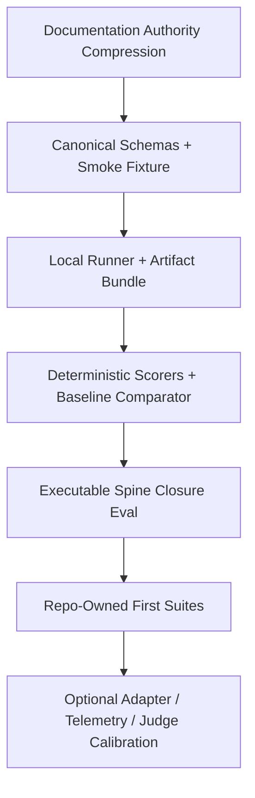
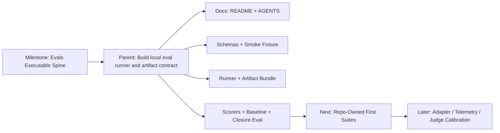

# Evals Executable Spine Linear Plan

schema_version: 1
selected_stage: he-linear-plan
subagent_policy: none_used
roles_used: he-linear-plan, he-reframe, he-strategy
roles_recommended: none_before_plan_review
roles_missing: live Linear verifier unavailable in this turn
linear_mutation_status: confirmation_required
live_linear_blocker: live Linear workspace, repo project, issue labels, project labels, and template IDs were not verified in this turn
required_confirmation: approve live Linear lookup and mutation before creating or updating any Linear object
decision_artifact_status: present
core_artifact_status: present
live_linear_setup_status: unavailable
label_status: unavailable
template_status: unavailable
repo_location_label: Repo › evals
project_assignment_reason: bounded executable-spine deliverable exists in .harness triage, strategy, reframe, and ADRs
cycle_assignment_reason: empty until user confirms this is current active execution
github_tracking_rule: primary implementation PR should include the primary Linear issue ID in branch, commit, or PR context
delivery_evidence_rule: done is not shipped; closure requires local eval artifact, validation command output, and PR/release/changelog evidence if delivery state matters

## Executive Linear Routing Summary

Create no live Linear objects yet. The correct plan is a small, confirmation-gated Linear slice for the `Evals Executable Spine` milestone.

The `.harness` cognition stack is already sufficient for execution routing. The strategy decision is stable: build the local proof spine before dashboards, adapters, telemetry exporters, cloud runners, plugin systems, or required LLM judge gates.

Recommended active Linear shape:

- Milestone: `Evals Executable Spine`
- Parent issue: `Build local eval runner and artifact contract`
- Four sub-issues:
  - `Compress documentation authority into README and AGENTS`
  - `Define canonical eval schemas and smoke fixture contract`
  - `Implement local runner and artifact bundle writer`
  - `Add deterministic scorers, baseline comparator, and closure eval`

Do not create separate Linear initiatives for strategy, ADRs, core invariants, dashboards, source mining, external adapters, telemetry, or judges. Those are either complete as documents, deferred, or explicitly blocked until local artifact proof exists.

## Target Linear Destination

Workspace/team: Jscraik

Team key: JSC

Top-level initiative: Dev Portfolio

Cross-repo project: Portfolio Ops only if this becomes cross-repo coordination across `coding-harness` and `agent-skills`.

Repo-specific destination: matching evals repo control project if it exists and is live-verified.

Mutation safety: blocked until live Linear lookup confirms the JSC team, repo project, labels, issue templates, statuses, and duplicate/archived/trashed state.

## Existing Project Match

existing_project_match:

- project name: evals
- live evidence source: unavailable in this turn
- status: needs_human_or_live_linear_verification
- duplicate/canceled alternatives: not inspected
- mutation safety: confirmation_required

Interpretation: the `.harness` artifacts justify a repo-specific execution slice, but not live mutation without checking whether an `evals` repo project already exists. If no matching project exists, keep the work in Portfolio Ops or unprojected with `Repo › evals` until Jamie confirms project creation.

## ADR / Decision Artifact Readiness

Status: present.

Decision artifacts already cover the expensive-to-reverse decisions needed for Linear planning:

- `ADR-001-executable-spine-before-expansion.md`: executable spine before dashboards, adapters, telemetry, cloud, plugins, or judge gates.
- `ADR-002-canonical-result-schema-and-adapter-boundary.md`: local canonical schema, external frameworks as adapters.
- `ADR-003-local-artifacts-authoritative-telemetry-explanatory.md`: local artifacts decide, telemetry explains.
- `ADR-004-repo-local-suites-own-domain-truth.md`: shared evals owns mechanics, consuming repos own domain truth.
- `ADR-005-llm-judges-advisory-until-calibrated.md`: judges advisory until calibrated.
- `ADR-006-fixture-provenance-privacy-and-holdout-policy.md`: provenance, privacy, redaction, owner, and holdout policy required for fixtures.

No new ADR is needed before filing the executable-spine parent issue.

## Core / Invariant Artifact Readiness

Status: present.

Core invariant coverage is sufficient for Linear planning:

- architecture: local-first harness, schema-runner-artifact-scorer-baseline sequence.
- routing: local runner before adapters, dashboards, telemetry, cloud execution, or judges.
- execution: observable local validation and artifact closure.
- governance: process must reduce ambiguity and become executable.
- cognition: root operating path must be cheaper than reading the full strategy stack.
- moat: real-regression fixtures and local proof discipline, not framework breadth.
- anti-drift: block duplicate schema, dashboard-first work, judge gates, telemetry-as-proof, and adapter leakage.
- agent rules: stop/defer if a change does not improve local artifact proof.

No new core file is needed before filing the executable-spine parent issue.

## Proposed Milestones

### Milestone: Evals Executable Spine

Purpose: make the repo produce one trustworthy local eval artifact bundle from one smoke fixture.

Scope:

- root operating docs;
- canonical schemas;
- local runner command;
- artifact bundle writer;
- deterministic scorers;
- baseline comparator;
- smoke fixture;
- closure eval artifact.

Out of scope:

- external eval framework adapters;
- Braintrust/OTEL exporters;
- dashboards or UI;
- cloud execution;
- plugin architecture;
- required LLM judge gates;
- broad source-mining automation;
- generic dataset registry;
- universal agent score.

Success evidence:

- `pnpm evals run fixtures/smoke/pr-closeout.case.json --json` or the implemented equivalent runs locally;
- output includes result JSON, Markdown report, command log, manifest, scorer results, and baseline status;
- `.harness/evals/evals-evals-executable-spine-eval.md` records validation proof;
- phase-one false-sophistication blocks remain true.

## Proposed Parent Issues

### Parent Issue: Build local eval runner and artifact contract

template: Feature
issue_type: feature
priority: 2
repo_location_label: Repo › evals
recommended labels: Type > Feature, Roadmap > Roadmap: Next, Developer Experience, Reliability
project: matching evals repo project if live-verified; otherwise empty or Portfolio Ops only by confirmation
cycle: empty until current execution is confirmed

## Objective

Build the smallest local eval spine that can run one smoke fixture and produce a trustworthy artifact bundle.

## Source Artifacts

- `.harness/triage/2026-05-18-evals-triage.md`
- `.harness/strategy/2026-05-18-evals-strategy.md`
- `.harness/refactors/stabilize-evals-executable-spine.md`
- `.harness/reframes/2026-05-18-evals-documentation-authority-compression.md`
- `.harness/decisions/ADR-001-executable-spine-before-expansion.md`
- `.harness/core/2026-05-18-evals-core.md`

## Why This Matters

The repo has enough architectural cognition. The next value is executable proof: a local command that writes evidence future humans and agents can inspect.

## Scope

- package/runtime skeleton;
- canonical eval case, result, artifact manifest, scorer result, and baseline result schemas;
- smoke fixture;
- local runner;
- artifact writer;
- deterministic scorers;
- baseline comparator;
- README and AGENTS operating surface;
- closure eval artifact.

## Out of Scope

- adapters;
- dashboards;
- hosted telemetry;
- cloud runner;
- plugin system;
- required judge gates;
- broad framework mining.

## Execution Notes

Keep phase one local-only and dependency-light. The implementation should optimize for a command that can run in a clean repo and produce replayable artifacts.

## Validation Gates

- local smoke command runs;
- result artifact validates against canonical schema;
- artifact bundle includes machine-readable and human-readable evidence;
- deterministic scorers drive required verdict;
- baseline comparator records status;
- no adapter, dashboard, telemetry exporter, cloud runner, plugin system, or required judge gate introduced.

## Rollback Conditions

- command cannot produce replayable local artifacts;
- schema is shaped by an external framework;
- result authority moves to telemetry, dashboard, PR comment, or judge report;
- fixture lacks provenance/privacy metadata;
- implementation needs cloud/network to pass.

## Linear Routing

Use `Repo › evals`; assign to the matching evals repo project only after live verification. Keep as one parent issue with four sub-issues.

## Proposed Sub-Issues

### Sub-Issue 1: Compress documentation authority into README and AGENTS

template: Governance / Policy
issue_type: governance_policy
priority: 2
repo_location_label: Repo › evals
recommended labels: Governance, Policy, Type > Docs, Roadmap > Roadmap: Next, Developer Experience
parent: Build local eval runner and artifact contract

Objective: add root `AGENTS.md` and `README.md` that make the executable-spine route obvious without reading the full `.harness` stack.

Source artifacts:

- `.harness/reframes/2026-05-18-evals-documentation-authority-compression.md`
- `.harness/core/2026-05-18-evals-core.md`
- `.harness/core/agent-operating-rules.md`
- `.harness/core/routing-invariants.md`
- `.harness/decisions/ADR-001-executable-spine-before-expansion.md`

Scope:

- document core doctrine;
- document read order;
- document phase-one hard blocks;
- document expected smoke command;
- document `.harness/reframes/**` as preferred new migration path and `.harness/refactors/**` as legacy evidence.

Out of scope: rewriting long-form intent/review/triage/strategy files.

Validation gates:

- future agent can identify `Evals Executable Spine` from root docs;
- root docs block dashboards, adapters, cloud, telemetry exporters, plugins, and judge gates before local artifact proof;
- documentation compression eval artifact is created at `.harness/evals/2026-05-18-evals-documentation-authority-compression-eval.md`.

Rollback conditions:

- root docs contradict ADR-001 through ADR-006;
- root docs create a new strategic direction;
- root docs hide fixture provenance or artifact authority rules.

### Sub-Issue 2: Define canonical eval schemas and smoke fixture contract

template: Feature
issue_type: feature
priority: 2
repo_location_label: Repo › evals
recommended labels: Type > Feature, Roadmap > Roadmap: Next, Reliability
parent: Build local eval runner and artifact contract

Objective: define the local canonical contracts before any runner or adapter implementation can drift.

Source artifacts:

- `.harness/decisions/ADR-002-canonical-result-schema-and-adapter-boundary.md`
- `.harness/decisions/ADR-006-fixture-provenance-privacy-and-holdout-policy.md`
- `.harness/features/2026-05-18-evals-intent.md`
- `.harness/triage/2026-05-18-evals-triage.md`

Scope:

- `eval-case.schema.json`;
- `eval-result.schema.json`;
- `artifact-manifest.schema.json`;
- `scorer-result.schema.json` or equivalent;
- `baseline-result.schema.json` or equivalent;
- one synthetic smoke fixture with owner/provenance/privacy metadata.

Out of scope: external framework schemas, adapter manifests for real integrations, judge prompts.

Validation gates:

- schemas are valid JSON;
- fixture validates against local schema or explicit local validator;
- schema fields do not use framework-native authority terms;
- fixture includes owner, source, privacy/redaction, and promotion status.

Rollback conditions:

- schema requires Braintrust, OpenAI Evals, DeepEval, FastEval, OpenEvals, or AutoEvals concepts as canonical fields;
- fixture provenance/privacy cannot be represented;
- baseline/result schema cannot express artifact paths.

### Sub-Issue 3: Implement local runner and artifact bundle writer

template: Feature
issue_type: feature
priority: 2
repo_location_label: Repo › evals
recommended labels: Type > Feature, Roadmap > Roadmap: Next, Reliability, Automation
parent: Build local eval runner and artifact contract

Objective: implement the smallest local command that runs the smoke fixture and writes a replayable artifact bundle.

Source artifacts:

- `.harness/refactors/stabilize-evals-executable-spine.md`
- `.harness/decisions/ADR-001-executable-spine-before-expansion.md`
- `.harness/decisions/ADR-003-local-artifacts-authoritative-telemetry-explanatory.md`
- `.harness/core/execution-invariants.md`

Scope:

- `package.json` or equivalent command surface;
- local CLI entrypoint;
- fixture loading;
- command execution or deterministic smoke execution;
- artifact writer;
- `result.json`;
- `report.md`;
- command log;
- manifest;
- `--json` output mode.

Out of scope: hosted telemetry, dashboards, adapters, cloud execution, judge gates.

Validation gates:

- `pnpm evals run fixtures/smoke/pr-closeout.case.json --json` or implemented equivalent succeeds locally;
- artifact bundle exists and includes raw command evidence;
- command failure produces a structured failure artifact;
- run does not require network or hosted services.

Rollback conditions:

- no local artifact bundle is written;
- pass/fail depends on telemetry or judge report;
- command surface is not deterministic enough for future agents to replay.

### Sub-Issue 4: Add deterministic scorers, baseline comparator, and closure eval

template: Feature
issue_type: feature
priority: 2
repo_location_label: Repo › evals
recommended labels: Type > Feature, Roadmap > Roadmap: Next, Reliability
parent: Build local eval runner and artifact contract

Objective: make required verdicts deterministic and record closure proof for the executable spine.

Source artifacts:

- `.harness/decisions/ADR-005-llm-judges-advisory-until-calibrated.md`
- `.harness/core/execution-invariants.md`
- `.harness/core/anti-drift-principles.md`
- `.harness/refactors/stabilize-evals-executable-spine.md`

Scope:

- deterministic scorer interface;
- exit-code scorer;
- required-output or required-artifact scorer;
- artifact-completeness scorer;
- baseline comparator;
- closure eval artifact at `.harness/evals/evals-evals-executable-spine-eval.md`.

Out of scope: LLM judge scoring as a required gate, judge calibration system, dashboard reporting.

Validation gates:

- required verdict is produced by deterministic scorers;
- baseline comparator records present/missing/delta status;
- closure eval cites command output, artifact paths, validation result, drift status, rollback status;
- no judge output can pass, fail, block, promote, or close the work.

Rollback conditions:

- scorer results are ambiguous or non-replayable;
- baseline comparison is hidden in prose only;
- judge output changes the required verdict.

## Now / Next / Later / Do Not Create

| Bucket | Work | Route | Why |
| --- | --- | --- | --- |
| Now | Evals Executable Spine | milestone + parent + four sub-issues | Only slice that turns documentation into proof |
| Now | Documentation authority compression | sub-issue under executable spine | Reduces context cost before implementation |
| Now | Canonical schemas and smoke fixture | sub-issue | Blocks framework schema drift |
| Now | Local runner and artifact bundle | sub-issue | Creates the trust surface |
| Now | Deterministic scorers, baseline, closure eval | sub-issue | Makes required proof replayable |
| Next | Repo-owned first suites | future parent after executable spine | Needs runner first |
| Next | Fixture provenance and trust discipline expansion | future parent after first real fixtures | Needs synthetic smoke lane first |
| Later | One external adapter proof | deferred issue only after two local suites | Prevents framework gravity |
| Later | Optional telemetry exporter | deferred issue only after artifact bundle and local trace | Telemetry explains, does not decide |
| Later | Judge calibration | deferred issue after deterministic scorer coverage | Judges remain advisory until calibrated |
| Do Not Create | Dashboard/UI | none | False sophistication before repeated local artifacts |
| Do Not Create | Cloud-only runner | none | Violates local artifact authority |
| Do Not Create | Plugin architecture | none | Premature until repeated adapter duplication exists |
| Do Not Create | Universal agent score | none | Vanity metric, weak domain truth |
| Do Not Create | Broad source-mining automation | none | Framework shopping before schema proof |

## Dependency Map



Dependency rules:

- Do not start adapter, dashboard, telemetry exporter, plugin, cloud, or judge-gate work before `C` and `D` are complete.
- Do not start repo-owned suite adoption before the smoke runner writes a valid artifact bundle.
- Do not close the milestone before `E` exists.

## Eval Gate Map

| Gate | Applies to | Required artifact | Blocks closure |
| --- | --- | --- | --- |
| Documentation compression eval | docs sub-issue | `.harness/evals/2026-05-18-evals-documentation-authority-compression-eval.md` | yes for docs compression |
| Executable spine eval | parent + milestone | `.harness/evals/evals-evals-executable-spine-eval.md` | yes |
| Schema validation evidence | schema sub-issue | schema validation output in eval artifact or report | yes |
| Artifact bundle evidence | runner sub-issue | run artifact path + manifest | yes |
| Deterministic verdict evidence | scorer sub-issue | scorer result JSON + baseline result | yes |
| False-sophistication guard | parent + milestone | explicit confirmation no dashboard/adapter/cloud/plugin/judge gate introduced | yes |

## Human vs Agent Execution Map

| Work | Agent-safe | Human review required | Notes |
| --- | --- | --- | --- |
| Root README/AGENTS compression | yes | no unless changing strategic priority | Keep compressed |
| Canonical schema draft | assisted | yes for schema authority changes | Expensive-to-reverse boundary |
| Synthetic smoke fixture | yes | no if clearly synthetic | Must include provenance/privacy metadata |
| Local runner | yes | no | Keep local-only and dependency-light |
| Artifact writer | yes | no | Must preserve raw evidence |
| Deterministic scorers | yes | no | Required verdict only |
| Baseline comparator | assisted | yes if promotion policy changes | Promotion affects trust |
| Fixture from real logs/sessions | assisted | yes | Privacy/provenance gate |
| Judge promotion | no | yes | Blocked until calibration proof |
| External adapter | assisted later | yes if schema impact | Deferred |

## Story / Value Basis

Story: as a future maintainer or coding agent, I need one local command that runs one eval fixture and writes a trustworthy artifact bundle, so I can tell whether agent workflow changes improved reliability without trusting prose, dashboards, hosted traces, or uncalibrated judge opinions.

Expected feedback signal: local command output, artifact bundle paths, deterministic scorer verdict, baseline status, and closure eval artifact.

Risk reduction: collapses execution ambiguity, blocks framework drift, and turns the docs' moat thesis into operational proof.

## Recommended Labels

Use live labels if verified. Conceptual mapping:

- `Repo › evals`
- `Type > Feature` for implementation issues
- `Type > Docs` for documentation compression
- `Roadmap > Roadmap: Next` for all proposed issues until active cycle is confirmed
- `Developer Experience`
- `Reliability`
- `Governance`
- `Policy`
- `Automation`

Missing label policy: if `Repo › evals` or required type/roadmap labels do not exist, block mutation and create reusable label payloads only after live verification.

## Repo / Location Label

Required: `Repo › evals`.

Fallback only if live workspace has legacy labels and no repo-location labels: `evals`.

Do not create the issue without a repo/location label.

## Priority Mapping

- Parent: priority 2 High, because it is a moat-critical execution blocker.
- Documentation compression sub-issue: priority 2 High, because it reduces future-agent routing ambiguity before implementation.
- Schema sub-issue: priority 2 High, because schema authority blocks framework drift.
- Runner/artifact sub-issue: priority 2 High, because it creates the trust surface.
- Scorer/baseline/eval sub-issue: priority 2 High, because it closes the required proof loop.
- Later adapter/telemetry/judge/dashboard work: no active priority; classify as deferred or Do Not Create.

## Project / Cycle Justification

Project assignment is justified only if a live `evals` repo control project exists or Jamie confirms use of Portfolio Ops as a temporary route.

Cycle assignment should remain empty until Jamie confirms this is the active execution commitment.

Do not create a new repo project from this plan without explicit approval.

## Project Reactivation Recommendation

No reactivation recommendation can be made without live Linear verification.

If a matching `evals` project exists but is archived, canceled, duplicated, or trashed, block mutation and ask Jamie which target is canonical.

## Portfolio Ops Items

Only one Portfolio Ops item may be justified later: coordinate adoption by `coding-harness` and `agent-skills` after the executable spine exists.

Do not use Portfolio Ops for the phase-one repo-local implementation unless no evals repo project exists and Jamie confirms it.

## Dev Portfolio Impact

Impact: the plan improves the Dev Portfolio operating model by turning architecture cognition into a bounded execution slice with closure proof.

Do not add a new Dev Portfolio initiative. `Evals Executable Spine` is a milestone or project slice, not a portfolio-level strategy initiative.

## GitHub PR Tracking

Primary branch pattern after Linear issue exists: `jsc-###-evals-executable-spine` or issue-specific variant.

Minimum: include the primary Linear issue identifier in branch name, commit body, PR title/body, or release notes.

Implementation PRs should point to the parent issue and mention completed sub-issues.

## Delivery Evidence

Required before marking parent complete:

- local command output;
- artifact bundle path;
- schema validation evidence;
- deterministic scorer evidence;
- baseline comparator output;
- `.harness/evals/evals-evals-executable-spine-eval.md`;
- no blocked false-sophistication paths introduced;
- GitHub PR/commit evidence if code is committed;
- release/changelog evidence only if claiming shipped state.

## Ready-To-Create Payloads

linear_mutation_status: confirmation_required

These payloads are plan-ready but not mutation-ready until live Linear project, label, and template checks pass.

### Payload: Parent

```yaml
title: Build local eval runner and artifact contract
template: Feature
priority: 2
team: JSC
project: verify matching evals repo project first
cycle: empty
labels:
  - Repo › evals
  - Type > Feature
  - Roadmap > Roadmap: Next
  - Developer Experience
  - Reliability
description: |
  ## Objective
  Build the smallest local eval spine that can run one smoke fixture and produce a trustworthy artifact bundle.

  ## Source Artifacts
  - .harness/triage/2026-05-18-evals-triage.md
  - .harness/strategy/2026-05-18-evals-strategy.md
  - .harness/refactors/stabilize-evals-executable-spine.md
  - .harness/reframes/2026-05-18-evals-documentation-authority-compression.md
  - .harness/decisions/ADR-001-executable-spine-before-expansion.md
  - .harness/core/2026-05-18-evals-core.md

  ## Why This Matters
  The repo has enough architecture cognition. It now needs executable proof.

  ## Scope
  Schemas, smoke fixture, local runner, artifact bundle writer, deterministic scorers, baseline comparator, README, AGENTS, closure eval.

  ## Out of Scope
  Adapters, dashboards, hosted telemetry, cloud runner, plugin system, required judge gates, broad framework mining.

  ## Execution Notes
  Keep local-first and dependency-light. Required verdicts must be deterministic.

  ## Validation Gates
  Local smoke command runs; artifact bundle exists; schemas validate; deterministic scorers produce verdict; baseline status recorded; closure eval exists.

  ## Rollback Conditions
  Roll back or block if proof depends on cloud, telemetry, dashboard, external framework schema, or judge output.

  ## Linear Routing
  Repo › evals. Assign to matching evals repo project only after live verification.
```

### Payload: Sub-Issue 1

```yaml
title: Compress documentation authority into README and AGENTS
template: Governance / Policy
priority: 2
team: JSC
parent: Build local eval runner and artifact contract
labels:
  - Repo › evals
  - Governance
  - Policy
  - Type > Docs
  - Roadmap > Roadmap: Next
description: |
  ## Objective
  Add root README.md and AGENTS.md that route agents to Evals Executable Spine without reading the full .harness stack.

  ## Source Artifacts
  - .harness/reframes/2026-05-18-evals-documentation-authority-compression.md
  - .harness/core/2026-05-18-evals-core.md

  ## Validation Gates
  Root docs state doctrine, read order, hard blocks, expected smoke command, .harness/reframes preference, and legacy .harness/refactors evidence status.

  ## Rollback Conditions
  Block if docs contradict ADR-001 through ADR-006 or create new strategy.
```

### Payload: Sub-Issue 2

```yaml
title: Define canonical eval schemas and smoke fixture contract
template: Feature
priority: 2
team: JSC
parent: Build local eval runner and artifact contract
labels:
  - Repo › evals
  - Type > Feature
  - Roadmap > Roadmap: Next
  - Reliability
description: |
  ## Objective
  Define local canonical schemas and one synthetic smoke fixture before runner or adapter implementation can drift.

  ## Validation Gates
  JSON schemas are valid; fixture validates; fixture includes owner, source, privacy/redaction, and promotion status; no external framework owns canonical fields.

  ## Rollback Conditions
  Block if schema requires external framework concepts as canonical authority or cannot represent artifact paths and provenance.
```

### Payload: Sub-Issue 3

```yaml
title: Implement local runner and artifact bundle writer
template: Feature
priority: 2
team: JSC
parent: Build local eval runner and artifact contract
labels:
  - Repo › evals
  - Type > Feature
  - Roadmap > Roadmap: Next
  - Reliability
  - Automation
description: |
  ## Objective
  Implement the smallest local command that runs the smoke fixture and writes result.json, report.md, command log, and manifest.

  ## Validation Gates
  pnpm evals run fixtures/smoke/pr-closeout.case.json --json or implemented equivalent succeeds locally; failure also writes structured artifact; no network or hosted service required.

  ## Rollback Conditions
  Block if no local artifact bundle is written or pass/fail depends on telemetry, dashboard, external framework, or judge report.
```

### Payload: Sub-Issue 4

```yaml
title: Add deterministic scorers, baseline comparator, and closure eval
template: Feature
priority: 2
team: JSC
parent: Build local eval runner and artifact contract
labels:
  - Repo › evals
  - Type > Feature
  - Roadmap > Roadmap: Next
  - Reliability
description: |
  ## Objective
  Make required verdicts deterministic and record closure proof for Evals Executable Spine.

  ## Validation Gates
  Deterministic scorer interface exists; exit-code and artifact/output completeness scorers run; baseline comparator records status; .harness/evals/evals-evals-executable-spine-eval.md exists.

  ## Rollback Conditions
  Block if judge output changes the required verdict or baseline comparison is prose-only.
```

## Evidence & Traceability Matrix

| Conclusion | Evidence | Affected files/modules | Confidence | Operational impact | Strategic impact | Why it matters |
| --- | --- | --- | --- | --- | --- | --- |
| One active Linear parent is enough | `.harness/triage/2026-05-18-evals-triage.md` says exactly one immediate initiative; `.harness/reframe/2026-05-18-evals-reframe.md` says one active parent issue | Linear milestone, parent issue | High | Prevents issue explosion | Keeps execution focused | The repo needs proof, not a backlog dump |
| Documentation compression should be a sub-issue, not a separate initiative | `.harness/reframes/2026-05-18-evals-documentation-authority-compression.md` maps it under executable spine | README, AGENTS, `.harness/core` | High | Reduces future-agent context load | Improves agent-native routing | Makes root docs the operating surface |
| Canonical schema must precede adapters | ADR-002; triage lines on schema before adapters | `schemas/**`, future `adapters/**` | High | Prevents incompatible results | Protects moat from framework lock-in | External frameworks are useful but not canonical |
| Local artifacts are closure authority | ADR-003; core execution invariants | artifact writer, result bundle, eval artifacts | High | Creates replayable proof | Protects trust | Telemetry and dashboards cannot replace evidence |
| LLM judges cannot be required gates now | ADR-005; triage judge warning | scorers, future judge metadata | High | Avoids false pass/fail | Preserves trust | Required proof must be deterministic |
| Repo-local suite work is Next, not Now | ADR-004; preserve repo-local suite reframe depends on executable spine | future `coding-harness` and `agent-skills` suite integrations | High | Prevents premature domain centralization | Preserves owner truth | Shared repo owns mechanics, not domain meaning |
| Live Linear mutation is blocked until verified | HE Linear Plan contract requires live setup/template/label verification | Linear workspace | High | Prevents duplicate/misfiled issues | Preserves portfolio hygiene | Plan-ready is not mutation-ready |

## Visual References / Diagrams



## Final Recommendation

After live Linear verification, create exactly the parent issue and four sub-issues above. Keep everything else in `Next`, `Later`, or `Do Not Create` until the local smoke command writes a valid artifact bundle.

