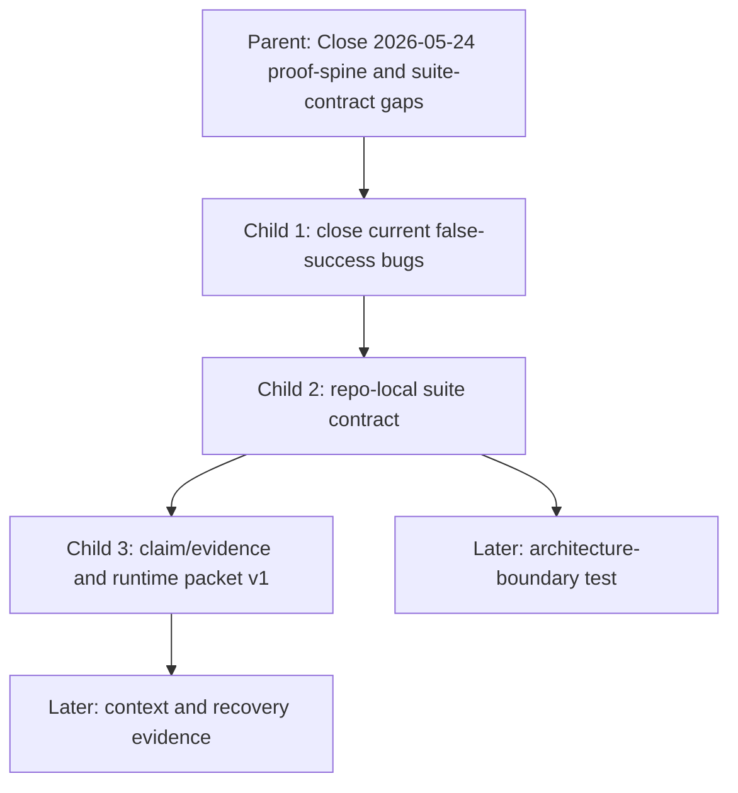

# Evals Proof-Spine Suite Contract Linear Plan

## Command Summary

BLUF: This document converts the 2026-05-24 evals audit into one live Linear parent issue and three child issues: first close current proof-spine trust bugs, then add the repo-local suite contract, then add Codex-native runtime evidence and claim verification. The work matters because `evals` is becoming the shared proof spine for `coding-harness`, `agent-skills`, and `diagram-cli/archscope`, but it is not safe for that role while latest evidence can be stale, run artifacts can collide, and suite/runtime contracts are missing. Treat `evals` as the intended repo/project name and use verified `Repo › evals` labels; project assignment remains unset because the connector did not return a live `evals` project and `Portfolio Ops` is trashed. The next action is to use the created issues as the tracker spine for the he-spec and subsequent implementation planning.
Decision Needed: none for issue creation; project assignment remains deferred until a live `evals` project is visible or Jamie names another destination.
Top Risks: false-success evidence can mislead downstream agents; project routing needs confirmation because `evals` was not visible as a live project; one issue per audit gap would create backlog noise.
Next Action: draft the he-spec against JSC-369 through JSC-372, then hand off Child 1 as the first implementation slice.

## Target Linear Destination

| Field | Value |
| --- | --- |
| Workspace/team | Jscraik / JSC |
| Team evidence | `mcp__linear__list_teams({ query: "JSC" })` returned team `Jscraik`, id `52ae4e68-6b65-418d-a8d6-c27b61b6ec92` |
| Initiative | Dev Portfolio verified, but no issue assignment proposed |
| Intended repo/project name | `evals` |
| Project | Confirmation-gated: use `evals` if Jamie confirms the live destination or it becomes visible to the connector |
| Project reason | `evals` is the intended project/repo name, but live lookup did not return a matching project; `Portfolio Ops` is trashed and is not safe for mutation |
| Status on creation | Triage or Todo, depending on Jamie's preferred intake flow |
| Cycle | Empty unless Jamie explicitly commits the Now child to the current cycle |
| Repo/location label | `Repo › evals` verified |
| Primary labels | `Eval`, `Reliability`, `Agent-Native`, `Roadmap: Now` or `Roadmap: Next`, `Feature` / `Bug` / `Policy` as listed per payload |

## Existing Project Match

existing_project_match:

- project_name: `evals`
- live_evidence_source: `mcp__linear__list_projects({ query: "evals" })` returned no projects
- status: intended_project_not_visible_to_connector
- duplicate_or_canceled_alternatives: none found for `evals`
- mutation_safety: project assignment blocked; issue labels are verified and safe to propose

Live project notes:

- `Dev Portfolio` exists and is active.
- `Portfolio Ops` exists under `Dev Portfolio`, but live evidence reports `trashed: true`.
- This plan does not recommend assigning repo-specific `evals` execution work to `Portfolio Ops`.

## ADR / Decision Artifact Readiness

decision_artifact_status: present

Decision evidence is sufficient for the selected execution slice:

- `.harness/core/2026-05-18-evals-core.md` defines the core doctrine: artifacts decide, telemetry explains, repo-local suites own domain truth, and external frameworks are adapters.
- `AGENTS.md` defines phase-one hard blocks and says evals owns runner mechanics, canonical schemas, artifact bundles, deterministic scorers, baseline shape, and closure evidence while consumers own domain truth.
- `.harness/research/audits/2026-05-24-evidence-led-codebase-gap-audit.md` is the approved cognition source for this plan.

No new ADR is required for the first child issue because it fixes current trust-boundary behavior. A compressed ADR or spec amendment is recommended before child issue 2 changes public suite semantics.

## Core / Invariant Artifact Readiness

core_artifact_status: present

Loaded core surfaces:

- `.harness/core/2026-05-18-evals-core.md`
- `UBIQUITOUS_LANGUAGE.md`
- `AGENTS.md`

Invariant constraints applied:

- Build the executable spine before expansion.
- Keep canonical schemas local.
- Keep artifacts authoritative.
- Keep telemetry explanatory.
- Keep repo-local suites owner-controlled.
- Do not add dashboards, external adapters, cloud runners, plugin systems, source-mining automation, required LLM judge gates, or runtime dependencies on sibling repos.

## Proposed Milestones

No live milestone should be created yet because `evals` is the intended project/repo name but the connector did not return a verified live `evals` project destination.

Plan-local milestone:

| Milestone | Purpose | Status |
| --- | --- | --- |
| Evals proof-spine trust and suite contract | Close immediate false-success risk, then add the smallest cross-repo suite contract and native runtime evidence packet | plan_only |

## Proposed Parent Issues

### Parent P1: [evals] Close 2026-05-24 proof-spine and suite-contract gaps

template: Feature

issue_type: feature

priority: 2

labels:

- `Repo › evals`
- `Eval`
- `Reliability`
- `Agent-Native`
- `Roadmap: Now`
- `Feature`

project: empty

cycle: empty unless Jamie confirms active commitment

Objective:

- Convert the 2026-05-24 evidence-led audit into a bounded implementation sequence that first fixes current trust-boundary failures and then adds the domain-neutral suite/runtime evidence contracts needed for `evals` to serve `coding-harness`, `agent-skills`, and `diagram-cli/archscope`.

Source Artifacts:

- `.harness/research/audits/2026-05-24-evidence-led-codebase-gap-audit.md`
- `.harness/research/audits/reviewers/2026-05-24-agent-native-reviewer.md`
- `.harness/research/audits/reviewers/2026-05-24-api-contract-reviewer.md`
- `.harness/research/audits/reviewers/2026-05-24-adversarial-reviewer.md`
- `.harness/core/2026-05-18-evals-core.md`
- `UBIQUITOUS_LANGUAGE.md`
- `AGENTS.md`

Why This Matters:

- The audit grades the repo C+ overall: strong local proof spine, but not yet safe as a shared cross-repo proof contract. The parent keeps the work sequenced so trust-boundary fixes land before broader suite or runtime evidence expansion.

Scope:

- Own the parent queue for three child issues.
- Keep phase-one hard blocks intact.
- Require `pnpm verify` evidence for each implementation child.
- Reconcile parent queue after each child closeout.

Out of Scope:

- Creating dashboards.
- Creating a plugin system.
- Creating external adapters as roots.
- Adding a generic real command runner.
- Making telemetry authoritative.
- Moving consumer domain truth into `evals`.

Validation Gates:

- Each child issue must run its listed gates.
- Parent can close only after all selected child issues are Done or explicitly deferred with evidence.

Rollback Conditions:

- Revert child-specific changes if `pnpm verify` fails or public CLI/schema contracts change without the required decision artifact.

Linear Routing:

- Team: JSC.
- Project: empty.
- Labels: `Repo › evals`, `Eval`, `Reliability`, `Agent-Native`.

## Proposed Sub-Issues

### Child 1: [evals] Close current proof-spine false-success bugs

template: Bug

issue_type: bug

priority: 2

roadmap: Now

labels:

- `Repo › evals`
- `Eval`
- `Reliability`
- `Roadmap: Now`
- `Bug`

Audit mapping:

- GAP-005: Smoke Check Is Not Bound to Smoke Latest Evidence.
- GAP-006: Run ID and Artifact Writes Are Not Concurrency-Safe.

Reproduction:

- Latest mismatch: run or construct a non-smoke latest bundle, then run `pnpm evals check --json`; current implementation validates the smoke fixture and latest pointer independently.
- Run ID collision: start two identical smoke runs in the same second; current run ID is timestamp-to-second plus case ID plus fixture hash, so both runs can target the same directory.

Expected Behavior:

- `pnpm evals check --json` fails when `latest.json` does not point to the canonical smoke case or checked suite.
- Concurrent identical runs produce distinct run IDs and isolated artifact directories.
- `latest.json` is published only after a complete bundle validates.

Actual Behavior:

- `check` can pass against the wrong latest bundle.
- Same-second identical runs can collide in artifact paths.

Affected Surface:

- `src/commands/validation.js`
- `src/commands/run.js`
- `src/lib/paths.js`
- `src/lib/json.js`
- `test/cli.test.js`

Validation Evidence:

- Add regression test for latest-to-smoke mismatch.
- Add concurrency or forced-collision test for run IDs.
- Run `pnpm test`.
- Run `pnpm evals check --json`.
- Run `pnpm verify`.

Acceptance Criteria:

- `check` binds latest evidence to the intended case.
- Run IDs are collision-resistant under concurrent identical invocations.
- Artifact writes do not publish incomplete bundles as latest.
- Existing smoke run output remains backward-compatible.

### Child 2: [evals] Add repo-local suite contract without plugin complexity

template: Feature

issue_type: feature

priority: 2

roadmap: Next

labels:

- `Repo › evals`
- `Eval`
- `Agent-Native`
- `Reliability`
- `Roadmap: Next`
- `Feature`

Audit mapping:

- GAP-001: Cross-Repo Suite Contract Is Missing.
- GAP-008: Shared Scorer Interface Is Hard-Coded.
- GAP-015: Governance Boundary Registry Is Documented Only.

Objective:

- Add the minimum schema and runtime path for `pnpm evals run path/to/.evals/suite.json --json`, with consumer-owned suite files and artifacts written into the evaluated repo.

Scope:

- Add `schemas/suite.schema.json`.
- Add suite-root path resolution for cases, scorers, baseline, and artifact destination.
- Add ownership fields: `suite_id`, `owner_repo`, `domain`, `purpose`, `cases`, `scorers`, `baseline`, and `artifact_policy`.
- Keep built-in scorer execution only; no local plugin loading.
- Add test fixture for an external temporary consumer repo.

Out of Scope:

- Registry.
- Plugin system.
- Dashboard.
- External adapters.
- Runtime dependency on `coding-harness`, `agent-skills`, or `diagram-cli`.

Files Likely To Change:

- `schemas/suite.schema.json`
- `src/cli.js`
- `src/commands/run.js`
- `src/lib/case-contract.js`
- `src/lib/schema.js`
- `src/lib/paths.js`
- `test/cli.test.js`
- `test/schema.test.js`

Validation Gates:

- `pnpm test`
- `pnpm evals run fixtures/smoke/pr-closeout.case.json --json`
- `pnpm verify`

Acceptance Criteria:

- Existing case-path execution remains compatible.
- A suite outside this repo can run.
- Artifacts are written under the evaluated repo's `.harness/evals/runs`.
- Suite-relative paths cannot escape the suite root.
- Suite ownership fields prevent evals from silently absorbing domain truth.

### Child 3: [evals] Add claim/evidence and Codex runtime evidence packet v1

template: Feature

issue_type: feature

priority: 2

roadmap: Next

labels:

- `Repo › evals`
- `Eval`
- `Agent-Native`
- `Reliability`
- `Roadmap: Next`
- `Feature`

Audit mapping:

- GAP-002: Native Codex Runtime Evidence Packet Is Missing.
- GAP-003: Claim-vs-Evidence Verification Is Not First-Class.
- GAP-004: Runtime State Packet Is Not a Full Runtime Card.
- GAP-007: Runtime Evidence Families Are Scaffolded But Not Enforced.
- GAP-014: Recovery Handling Is Mostly Absent.

Objective:

- Add a versioned local-file contract for Codex runtime evidence packets and first-class claim/evidence verification without making evals the Codex runtime authority.

Scope:

- Add `schemas/codex-runtime-evidence.schema.json`.
- Add `schemas/claim-evidence.schema.json`.
- Add a deterministic `false-success` scorer for command/artifact claims.
- Add runtime-card v1 fields to `state --json` or a dedicated `runtime-card.schema.json`.
- Graduate one provenance family from scaffolded to enforced after packet shape exists, preferably goal/thread provenance.

Out of Scope:

- Required LLM judge gates.
- Telemetry exporter authority.
- External API freshness polling in the first slice.
- Generic recovery engine.

Files Likely To Change:

- `schemas/codex-runtime-evidence.schema.json`
- `schemas/claim-evidence.schema.json`
- `schemas/runtime-card.schema.json`
- `src/lib/runtime-evidence-contract.js`
- `src/lib/runtime-state.js`
- `src/lib/scoring.js`
- `fixtures/runtime-evidence/*.case.json`
- `test/cli.test.js`

Validation Gates:

- `pnpm test`
- `pnpm evals state --json`
- `pnpm evals check --json`
- `pnpm verify`

Acceptance Criteria:

- A claim that validation passed without validation evidence fails deterministically.
- A claim that an artifact exists without manifest/hash evidence fails deterministically.
- A Codex runtime evidence packet with thread/turn/tool/artifact/validation fields validates.
- Existing runtime evidence fixtures remain compatible or version-gated.
- `state --json` exposes freshness/authority fields without breaking existing consumers.

## Now / Next / Later / Do Not Create

| Bucket | Item | Linear Action | Reason |
| --- | --- | --- | --- |
| Now | Child 1: proof-spine false-success bugs | Create as child of parent | Current implementation trust risk; smallest safe first patch |
| Next | Child 2: repo-local suite contract | Create as child of parent | Needed for cross-repo proof spine; public contract needs bounded issue |
| Next | Child 3: claim/evidence and runtime packet v1 | Create as child of parent | Codex-native readiness blocker; depends on trust boundary and contract decisions |
| Later | Architecture-boundary test | Do not create now | Fold into Child 2 if suite work starts to spread across modules |
| Later | Closure evidence machine gate | Do not create now | Fold into Child 1 or parent closeout if closeout drift recurs |
| Later | Smoke fixture trace expectation | Do not create now | Low-severity cleanup; can be bundled into any nearby fixture touch |
| Later | Context evidence scorer | Do not create now | Depends on runtime evidence packet |
| Later | Recovery evidence schema | Do not create now | Depends on runtime evidence packet |
| Do Not Create | One issue per audit gap | Refuse | Creates backlog noise and violates smallest-useful-object rule |
| Do Not Create | Dashboard / plugin system / cloud runner | Refuse | Violates phase-one hard blocks |

## Dependency Map



## Eval Gate Map

| Issue | Required Gates | Stop Condition |
| --- | --- | --- |
| Parent | Child gates complete or explicitly deferred | Any selected child lacks validation evidence |
| Child 1 | `pnpm test`, `pnpm evals check --json`, `pnpm verify` | Latest mismatch or run collision test missing |
| Child 2 | `pnpm test`, external temporary suite fixture, `pnpm verify` | Suite path can escape root or artifacts write to wrong repo |
| Child 3 | `pnpm test`, `pnpm evals state --json`, `pnpm evals check --json`, `pnpm verify` | Claim without evidence can still pass |

## Human vs Agent Execution Map

| Work | Human Route | Agent Route |
| --- | --- | --- |
| Parent issue approval | Jamie confirms object set and whether to create all children or first child only | Prepare payloads only |
| Child 1 implementation | Human reviews trust-boundary behavior and artifact churn | Codex can implement with tests and `pnpm verify` |
| Child 2 public contract | Human confirms suite schema fields and domain-boundary wording | Codex can implement after decision confirmation |
| Child 3 runtime evidence packet | Human confirms public packet shape and compatibility policy | Codex can implement versioned schema and fixture scorer |
| Linear mutation | Human approves creation | Codex can create/update only after approval |

## Story / Value Basis

The 2026-05-24 audit says `evals` is valuable because it can become the shared executable proof spine for multiple repos, but only if it stays domain-neutral. The plan therefore routes work by trust boundary rather than by audit section count:

1. Keep current local proof trustworthy.
2. Add the cross-repo suite contract that keeps consumer truth local.
3. Add the runtime evidence and claim verification primitives that make Codex-native proof real.

This preserves the repo doctrine: artifacts decide, telemetry explains, and consuming repos own domain truth.

## Recommended Labels

label_status: verified

Verified issue labels:

- `Repo › evals`
- `Eval`
- `Reliability`
- `Agent-Native`
- `Governance`
- `Roadmap: Now`
- `Roadmap: Next`
- `Feature`
- `Bug`
- `Policy`
- `Research`

No new labels are recommended.

## Repo / Location Label

repo_location_label: `Repo › evals`

Every proposed issue payload uses this label. Legacy plain repo labels are not needed.

## Priority Mapping

| Issue | Priority | Rationale |
| --- | --- | --- |
| Parent | 2 High | Architecture and trust-boundary work that gates cross-repo adoption |
| Child 1 | 2 High | Current false-success and artifact corruption risk |
| Child 2 | 2 High | Public suite contract required before multi-repo use |
| Child 3 | 2 High | Codex-native readiness blocker |

## Project / Cycle Justification

project_assignment_reason: confirmation_gated

- `evals` is the intended repo/project name.
- Live project lookup did not return a matching `evals` project.
- `Portfolio Ops` is not safe for assignment because it is trashed.
- These are repo-specific execution issues, so `Repo › evals` labels are sufficient until the live `evals` project is confirmed or becomes visible.

cycle_assignment_reason: empty

- Current cycle exists, but creation should not auto-commit work to the cycle without Jamie confirming active execution.
- If Jamie selects only Child 1 as the Now slice, Child 1 can be placed in the current cycle.

## Project Reactivation Recommendation

No project reactivation is recommended from this plan.

If Jamie wants a live project destination, use `evals` as the intended project name, but first confirm why the live connector did not return it. If it does not exist, decide whether to create a canonical `evals` repo control project under `Dev Portfolio`. Do not use the trashed `Portfolio Ops` project for repo-specific work.

## Portfolio Ops Items

None now.

The cross-repo suite contract will eventually affect `coding-harness`, `agent-skills`, and `diagram-cli/archscope`, but the first executable work remains repo-local in `evals`. Portfolio coordination can wait until a consumer suite is ready to land.

## Dev Portfolio Impact

- Dev Portfolio live status: active.
- Impact: this plan supports the broader portfolio by making `evals` a safer proof substrate.
- Mutation recommendation: do not attach to Dev Portfolio initiative until a verified `evals` project or cross-repo coordination issue exists.

## GitHub PR Tracking

github_tracking_rule:

- Each implementation child should use a primary Linear issue identifier in branch and PR context when created.
- Preferred branch examples after creation:
  - `jsc-XXX-evals-close-proof-spine-false-success`
  - `jsc-YYY-evals-add-repo-local-suite-contract`
  - `jsc-ZZZ-evals-add-runtime-evidence-packet`

No PR is currently linked because implementation has not started.

## Delivery Evidence

delivery_evidence_rule:

- Done means implementation accepted with local validation evidence.
- Merged means PR merged.
- Released/shipped requires release, tag, deployment, changelog, package, or manual release evidence if that distinction matters.

Minimum closeout evidence per child:

- Exact validation command outputs.
- Changed files.
- Artifact paths when `pnpm verify` generates run evidence.
- Parent queue reconciliation after child closeout.

## Evidence & Traceability Matrix

| Plan Object | Source Evidence | Gaps Covered | Live Linear Evidence | Mutation Status |
| --- | --- | --- | --- | --- |
| Parent P1 | 2026-05-24 audit executive summary and roadmap | All selected gaps | Created as JSC-369; JSC team and labels verified; `evals` project intended but not visible to connector | created |
| Child 1 | Audit GAP-005, GAP-006; adversarial reviewer artifact | False-success latest mismatch; run ID collision | Created as JSC-370 under JSC-369; existing similar older issues are Done, not duplicates | created |
| Child 2 | Audit GAP-001, GAP-008, GAP-015; core doctrine | Cross-repo suite contract and ownership boundary | Created as JSC-371 under JSC-369; `evals` project intended but not visible to connector; labels verified | created |
| Child 3 | Audit GAP-002, GAP-003, GAP-004, GAP-007, GAP-014; agent-native/API reviewer artifacts | Codex runtime packet, claim/evidence, runtime card | Created as JSC-372 under JSC-369; no duplicate live issue found for evals 2026-05-24 packet | created |

## Linear Mutation Record

linear_mutation_status: created

Created on 2026-05-24 after Jamie requested mutation through the Linear plugin.

| Issue | Title | URL | Status |
| --- | --- | --- | --- |
| JSC-369 | [evals] Close 2026-05-24 proof-spine and suite-contract gaps | https://linear.app/jscraik/issue/JSC-369/evals-close-2026-05-24-proof-spine-and-suite-contract-gaps | Triage |
| JSC-370 | [evals] Close current proof-spine false-success bugs | https://linear.app/jscraik/issue/JSC-370/evals-close-current-proof-spine-false-success-bugs | Triage |
| JSC-371 | [evals] Add repo-local suite contract without plugin complexity | https://linear.app/jscraik/issue/JSC-371/evals-add-repo-local-suite-contract-without-plugin-complexity | Triage |
| JSC-372 | [evals] Add claim/evidence and Codex runtime evidence packet v1 | https://linear.app/jscraik/issue/JSC-372/evals-add-claimevidence-and-codex-runtime-evidence-packet-v1 | Triage |

Mutation notes:

- All issues were created in the JSC team with priority High and verified `Repo › evals` labels.
- Child issues were created with `parentId: JSC-369`.
- Project assignment remains empty because live project lookup for `evals` returned no project and `Portfolio Ops` is trashed.
- Template intent is recorded in each issue description because the active Linear mutation surface did not expose template IDs.

## Ready-To-Create Payloads

linear_mutation_status: created

creation_authority:

- Jamie requested mutation with the Linear plugin on 2026-05-24.
- Parent P1 plus Child 1, Child 2, and Child 3 were created.

live_linear_blocker:

- `evals` project destination not visible to connector; confirmation needed before project assignment.
- `Portfolio Ops` exists but is trashed.

### Payload: Parent P1

```text
Template: Feature
Team: JSC
Title: [evals] Close 2026-05-24 proof-spine and suite-contract gaps
Priority: High
Project: empty
Cycle: empty
Labels: Repo › evals, Eval, Reliability, Agent-Native, Roadmap: Now, Feature

## Objective
Convert the 2026-05-24 evidence-led audit into a bounded implementation sequence that first fixes current proof-spine trust failures, then adds the repo-local suite contract, then adds Codex-native runtime evidence and claim verification.

## Source Artifacts
- .harness/research/audits/2026-05-24-evidence-led-codebase-gap-audit.md
- .harness/research/audits/reviewers/2026-05-24-agent-native-reviewer.md
- .harness/research/audits/reviewers/2026-05-24-api-contract-reviewer.md
- .harness/research/audits/reviewers/2026-05-24-adversarial-reviewer.md
- .harness/core/2026-05-18-evals-core.md
- UBIQUITOUS_LANGUAGE.md
- AGENTS.md

## Why This Matters
evals is positioned to become the shared executable proof spine for coding-harness, agent-skills, and diagram-cli/archscope. The audit shows it has a strong local spine but needs current trust-boundary fixes and explicit suite/runtime evidence contracts before broader use.

## Scope
- Own the parent queue for the selected child issues.
- Preserve phase-one hard blocks.
- Require validation evidence and parent-loop reconciliation after each child.

## Out of Scope
- Dashboards
- Plugin systems
- External adapters as roots
- Cloud runners
- Required LLM judge gates
- Runtime dependencies on sibling repos

## Execution Notes
Start with Child 1. Do not implement suite or runtime packet changes until the current proof-spine false-success bugs are closed.

## Validation Gates
- Child issue validation gates pass.
- pnpm verify passes after each implementation child.

## Rollback Conditions
Rollback any child change that breaks pnpm verify or changes public CLI/schema contracts without decision evidence.

## Linear Routing
Team: JSC
Project: empty
Repo label: Repo › evals
```

### Payload: Child 1

```text
Template: Bug
Team: JSC
Title: [evals] Close current proof-spine false-success bugs
Priority: High
Project: empty
Cycle: empty unless Jamie confirms current commitment
Labels: Repo › evals, Eval, Reliability, Roadmap: Now, Bug

## Objective
Fix the two current proof-spine trust bugs from the 2026-05-24 audit: check/latest provenance mismatch and concurrent run artifact collision.

## Source Artifacts
- .harness/research/audits/2026-05-24-evidence-led-codebase-gap-audit.md#GAP-005
- .harness/research/audits/2026-05-24-evidence-led-codebase-gap-audit.md#GAP-006
- .harness/research/audits/reviewers/2026-05-24-adversarial-reviewer.md

## Why This Matters
The local proof spine cannot be trusted for broader adoption if the check command can validate the wrong latest run or if simultaneous runs can corrupt artifact bundles.

## Scope
- Bind check/latest evidence to the canonical smoke case or checked suite.
- Make run IDs collision-resistant under concurrent identical invocations.
- Prevent latest publication before bundle validation completes.
- Add regression tests.

## Out of Scope
- Suite contract.
- Runtime evidence packet.
- Real command execution.

## Execution Notes
Prefer the smallest patch that fixes the current behavior. Keep public JSON output compatible except for explicit new failure reasons.

## Validation Gates
- pnpm test
- pnpm evals check --json
- pnpm verify

## Rollback Conditions
Rollback if existing smoke run JSON output breaks or pnpm verify fails.

## Linear Routing
Team: JSC
Project: empty
Repo label: Repo › evals
```

### Payload: Child 2

```text
Template: Feature
Team: JSC
Title: [evals] Add repo-local suite contract without plugin complexity
Priority: High
Project: empty
Cycle: empty
Labels: Repo › evals, Eval, Agent-Native, Reliability, Roadmap: Next, Feature

## Objective
Add the minimal repo-local suite contract so evals can run consumer-owned .evals/suite.json files while keeping artifacts in the evaluated repo.

## Source Artifacts
- .harness/research/audits/2026-05-24-evidence-led-codebase-gap-audit.md#GAP-001
- .harness/research/audits/2026-05-24-evidence-led-codebase-gap-audit.md#GAP-008
- .harness/research/audits/2026-05-24-evidence-led-codebase-gap-audit.md#GAP-015
- .harness/core/2026-05-18-evals-core.md

## Why This Matters
evals cannot become the shared proof contract for coding-harness, agent-skills, and diagram-cli/archscope if it requires consumer fixtures to live inside the evals repo or if evals absorbs domain truth.

## Scope
- Add schemas/suite.schema.json.
- Support pnpm evals run path/to/.evals/suite.json --json.
- Resolve case/scorer/baseline paths relative to the suite root.
- Write artifacts under the evaluated repo.
- Keep scorer execution built-in only.

## Out of Scope
- Registry.
- Plugin system.
- Dashboard.
- External adapters.
- Runtime dependency on consumer repos.

## Execution Notes
Compare smallest pathing patch with a suite-resolver owner module before editing runtime code.

## Validation Gates
- pnpm test
- external temporary suite fixture proves artifacts write to evaluated repo
- pnpm verify

## Rollback Conditions
Rollback if existing case-path execution breaks or suite paths can escape the suite root.

## Linear Routing
Team: JSC
Project: empty
Repo label: Repo › evals
```

### Payload: Child 3

```text
Template: Feature
Team: JSC
Title: [evals] Add claim/evidence and Codex runtime evidence packet v1
Priority: High
Project: empty
Cycle: empty
Labels: Repo › evals, Eval, Agent-Native, Reliability, Roadmap: Next, Feature

## Objective
Add versioned local-file contracts for Codex runtime evidence and claim-vs-evidence verification so evals can score runtime proof without becoming the Codex runtime authority.

## Source Artifacts
- .harness/research/audits/2026-05-24-evidence-led-codebase-gap-audit.md#GAP-002
- .harness/research/audits/2026-05-24-evidence-led-codebase-gap-audit.md#GAP-003
- .harness/research/audits/2026-05-24-evidence-led-codebase-gap-audit.md#GAP-004
- .harness/research/audits/reviewers/2026-05-24-agent-native-reviewer.md
- .harness/research/audits/reviewers/2026-05-24-api-contract-reviewer.md

## Why This Matters
The audit identifies claim-vs-evidence and native Codex runtime evidence as the highest-risk missing systems. Without them, agents can still make completion claims that local artifacts do not prove.

## Scope
- Add codex-runtime-evidence schema.
- Add claim-evidence schema.
- Add false-success scorer for command/artifact claims.
- Add runtime-card freshness/authority fields.
- Enforce one currently scaffolded provenance family after packet shape exists.

## Out of Scope
- Required LLM judge gates.
- Telemetry exporter authority.
- External freshness polling in the first slice.
- Generic recovery engine.

## Execution Notes
This child should not start until Child 1 is closed and the public suite/runtime packet boundary is confirmed.

## Validation Gates
- pnpm test
- pnpm evals state --json
- pnpm evals check --json
- pnpm verify

## Rollback Conditions
Rollback if a claim without evidence can pass or existing runtime evidence fixtures become ambiguous without a version gate.

## Linear Routing
Team: JSC
Project: empty
Repo label: Repo › evals
```

## Visual References / Diagrams

The dependency map above is the visual reference for this plan. No generated media is needed because this is a tracker execution plan, not a visual-output review.

## Validation Record

Planned validation for this artifact:

- `python3 /Users/jamiecraik/dev/agent-skills/Plugins/harness-engineering/scripts/check_bluf_structure.py .harness/linear/2026-05-24-evals-proof-spine-suite-contract-linear-plan.md --json`
- `pnpm verify`

Current validation status:

- BLUF structure: pass (`python3 /Users/jamiecraik/dev/agent-skills/Plugins/harness-engineering/scripts/check_bluf_structure.py .harness/linear/2026-05-24-evals-proof-spine-suite-contract-linear-plan.md --json`).
- Spec BLUF structure: pass (`python3 /Users/jamiecraik/dev/agent-skills/Plugins/harness-engineering/scripts/check_bluf_structure.py .harness/specs/2026-05-24-evals-proof-spine-suite-contract-spec.md --json`).
- Spec generated artifact shape: pass (`python3 /Users/jamiecraik/dev/agent-skills/Plugins/harness-engineering/scripts/check_generated_artifact_shape.py .harness/specs/2026-05-24-evals-proof-spine-suite-contract-spec.md --kind spec --json`).
- Repository gate: pass (`pnpm verify`; latest generated run `20260524T193620Z-pr-closeout-4df36134`).
