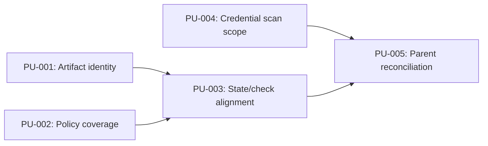
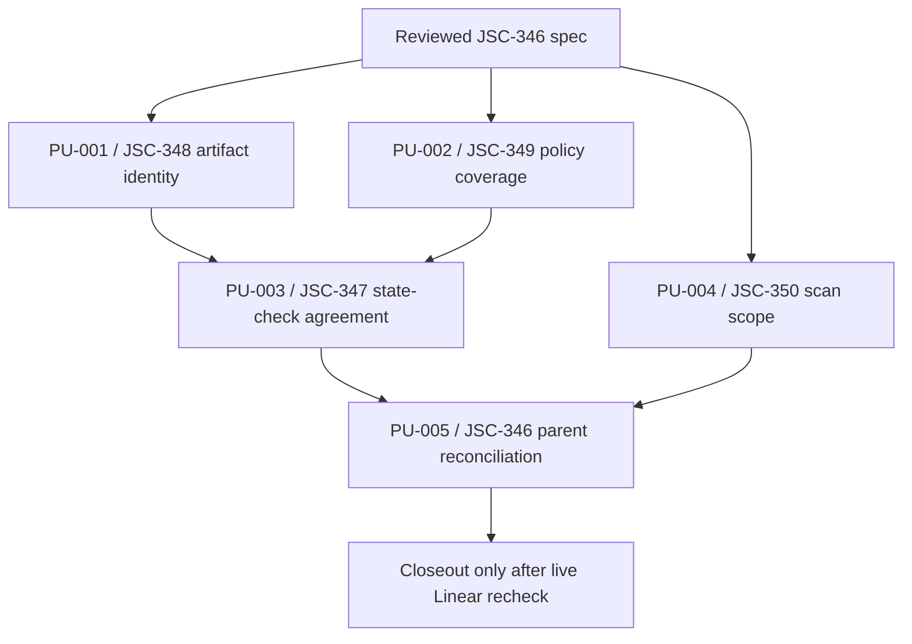

# JSC-346 Runtime Evidence Trust Boundary Plan

## Command Summary

BLUF: This plan gives the operator, developer, reviewer, and future agent a bounded execution contract for the reviewed JSC-346 runtime evidence trust-boundary spec: artifact identity proof, policy coverage enforcement, runtime state/check agreement, credential scan proof-surface coverage, and parent-loop reconciliation. The work matters because the current executable spine can pass local checks while still leaving future agents room to overtrust readiness, artifact, policy, or scan claims. Execution is bounded to local deterministic proof surfaces in src, schemas, fixtures, test or tests, and scripts/verify.js; it must not open dashboards, source mining, external adapters, packaged runtime launchers, plugin systems, LLM judge authority, or sibling repo runtime dependencies. The highest stop risk is a public JSON contract change that cannot remain additive, so schema/version compatibility and golden or schema-backed tests are mandatory before closeout. The handoff after this plan is he-work only when implementation is explicitly authorized, with live Linear state rechecked before any JSC-346 parent closeout.

Decision Needed: None for planning. Implementation may start from this plan when authorized.

Top Risks:

- False readiness can continue if pnpm evals state --json stays decoupled from runtime-evidence suite health.
- False artifact success can continue if subagent artifact checks count events without matching subagent_id, artifact type, and artifact path.
- Public JSON shape drift can break agent consumers if new contract health fields are added without schema/version tests.
- Credential scan expansion can fail on documentation prose if the existing broad keyword pattern is applied to proof docs without tested false-positive classification.
- Parent closeout can be overstated if JSC-347 through JSC-350 are not reconciled against live Linear state.

Next Action: Start PU-001 or PU-002 first because scorer correctness is the smallest deterministic trust boundary; do not begin PU-003 until runtime-evidence contract failures are reliable enough for state to consume.

## Objective

Implement the approved JSC-346 trust-boundary slice as small, proof-producing changes. The result should make the local evals proof surface stricter without changing the repo's phase-one mission or adding external runtime authority.

## Source Contract

| Source | Role | Freshness / Status |
|---|---|---|
| .harness/specs/2026-05-22-jsc-346-runtime-evidence-trust-boundary-spec.md | Canonical behavior and acceptance contract | reviewed |
| .harness/linear/2026-05-22-evals-runtime-evidence-enforcement-linear-plan.md | Local Linear trace and child issue mapping | live issues verified 2026-05-22; live recheck required before closeout |
| .harness/research/audits/2026-05-22-evidence-led-codebase-gap-audit.md | Audit basis for gaps and risks | present |
| AGENTS.md | Repo mission, hard blocks, validation, tracker rule | binding |
| .harness/core/2026-05-18-evals-core.md | Executable-spine doctrine | binding context |
| UBIQUITOUS_LANGUAGE.md | Runtime-state and runtime-evidence terms | binding vocabulary |
| .harness/refactors/2026-05-20-deep-module-fix-mechanics.md | Deep module patch discipline | required for runtime/schema/validation changes |

Source acceptance IDs:

| Acceptance | Linear Trace | Required Proof |
|---|---|---|
| SA-001 | JSC-347 | Runtime-evidence contract failure makes pnpm evals check --json fail and pnpm evals state --json non-ready. |
| SA-002 | JSC-348 | Artifact contract requires matching subagent_id, artifact type, and artifact path, including negative duplicate/path cases. |
| SA-003 | JSC-349 | Unenforced policy family fails with machine-readable policy coverage error. |
| SA-004 | JSC-350 | Credential scan target contract covers proof roots or tested exclusions; rg and Node fallback agree. |
| SA-005 | JSC-346 | Parent closeout cites child status, validation, remaining risk, live tracker recheck, and parent-loop decision. |

## Scope and Boundaries

Allowed paths and areas:

- src/lib/runtime-evidence-contract.js
- src/lib/runtime-state.js
- src/commands/validation.js
- schemas/runtime-evidence-case.schema.json
- schemas/runtime-state.schema.json
- fixtures/runtime-evidence/**
- test/** and tests/**
- scripts/verify.js
- .harness/plan/**
- implementation evidence artifacts required by repo guidance, when produced by the implementation lane

Forbidden paths and areas for this slice:

- dashboards or UI reporting
- external project adapters
- cloud runners
- packaged Codex runtime launcher
- source-mining automation from real sessions or rollouts
- required LLM judge gates
- runtime dependencies on coding-harness or agent-skills
- broad docs rewrites unrelated to this trust-boundary slice
- Linear mutation without explicit live-update authorization
- generated dependency directories or package-manager stores

Implementation-time unknowns:

- Whether runtime-state should remain schema_version 1 with additive optional fields or move to a new schema version depends on the exact public JSON shape chosen during PU-003.
- Whether policy coverage is per-case, per-suite, or both is flexible only if the canonical machine-readable location remains runtime_evidence.policy_coverage or a reviewed equivalent.
- Exact test file placement should follow current test organization discovered during implementation; do not add a new test framework.
- Exact public check/state JSON fields must stay within the spec's compatibility rules; incompatible output-shape changes require a recorded ADR or spec amendment before implementation continues.

## Current State / Evidence

| Surface | Current Evidence | Gap |
|---|---|---|
| Runtime evidence suite | src/lib/runtime-evidence-contract.js validates and scores runtime-evidence fixtures; scorer IDs are permission-drift, subagent-artifact-contract, and plugin-attribution. | No policy coverage registry or machine-readable coverage result. |
| Subagent artifact scorer | scoreSubagentArtifactContract currently counts SubagentStart, ArtifactExpected, and ArtifactWritten by subagent_id. | It does not yet prove artifact type/path identity or ambiguous duplicate writes. |
| Runtime state | src/lib/runtime-state.js builds status from latest-run validation and artifact presence. | It does not consume runtime-evidence suite health. |
| Runtime-state schema | schemas/runtime-state.schema.json uses additionalProperties false and schema_version const 1. | Any new public field requires schema/version compatibility work. |
| Check command | src/commands/validation.js calls validateRuntimeEvidenceSuite() and includes runtime evidence checks in pnpm evals check --json. | Check output lacks the spec's policy coverage surface. |
| Verify scanner | scripts/verify.js scans currently discovered credential roots and has an EVALS_VERIFY_FORCE_NODE_CREDENTIAL_SCAN=1 fallback path. | Scan target contract needs proof roots and parity tests for fallback behavior. |
| CI gate | .github/workflows/ci.yml and .harness/ci-required-checks.json route to pnpm verify. | JSC-350 must preserve deterministic CI behavior. |
| Candidate expanded credential scan | Dry-run search across proof-bearing roots currently reports prose/source matches for words like secret and token. | PU-004 must add tested pattern classes, false-positive handling, or explicit exclusions before expanded roots can be treated as passing proof. |
| Linear tracker state | Live Linear lookup on 2026-05-22 confirmed JSC-346 through JSC-350 exist and remain unstarted/Todo. | Parent closeout still needs a fresh live recheck because tracker state can drift. |

Current validation snapshot from the planning/spec review lane:

| Command | Result | Notes |
|---|---|---|
| python3 /Users/jamiecraik/dev/agent-skills/Plugins/harness-engineering/scripts/check_bluf_structure.py .harness/specs/2026-05-22-jsc-346-runtime-evidence-trust-boundary-spec.md --json | pass | Spec BLUF shape valid. |
| python3 /Users/jamiecraik/dev/agent-skills/Plugins/harness-engineering/scripts/check_generated_artifact_shape.py .harness/specs/2026-05-22-jsc-346-runtime-evidence-trust-boundary-spec.md --kind spec --json | pass | Spec artifact shape valid. |
| pnpm test | pass | Current suite passes before implementation. |
| pnpm evals check --json | pass | Current check command runs; new policy coverage behavior still requires implementation. |
| pnpm evals state --json | pass | Current state command runs; new runtime-evidence health behavior still requires implementation. |
| pnpm verify | pass | Current deterministic gate passes and generated a fresh eval run. |

## Implementation Strategy

Execute scorer trust boundaries before state aggregation. PU-001 and PU-002 make runtime-evidence failures precise enough for PU-003 to consume without duplicating logic. PU-004 can run in parallel with PU-001 or PU-002 because credential scan coverage is independent. PU-005 is last and is a delivery reconciliation unit, not runtime proof authority.

Implementation principles:

- Prefer one deep owner module per behavior.
- Keep check/state consumers using shared runtime-evidence validation rather than duplicating scorer logic.
- Use schema-backed output when public JSON changes.
- Add negative fixtures before or with implementation so false-success cases are executable.
- Preserve current top-level runtime-state status values unless a reviewed schema version changes them.
- Keep telemetry explanatory only; artifacts, schemas, scorer results, and deterministic gates decide.

## Enforcement Contract

essential_decisions:

- JSC-346 is a deterministic local proof hardening slice.
- Runtime evidence health must be machine-readable.
- Subagent artifact proof requires identity match, not event counts alone.
- Policy coverage must classify declared policy families as enforced, scaffolded, or missing enforcement.
- Credential scanning must cover proof-bearing surfaces or justify exclusions with tests.
- Parent closeout requires child issue reconciliation and live Linear recheck.

fillable_gaps:

- Exact helper names for identity keys, policy registry, and scan root constants.
- Exact schema version strategy for runtime-state output after implementation inspection.
- Exact placement of focused tests under current test or tests layout.
- Exact public check/state JSON field names only within the spec's compatibility rules; incompatible output-shape changes require a recorded ADR or spec amendment before implementation continues.

guardrails:

- pnpm test
- pnpm evals check --json
- pnpm evals state --json
- pnpm verify
- EVALS_VERIFY_FORCE_NODE_CREDENTIAL_SCAN=1 node scripts/verify.js when PU-004 touches credential fallback behavior.
- Schema or golden-output tests for any public JSON output change.

refusal_triggers:

- Proposal to add dashboards, source mining, external adapters, packaged runtime launcher, plugin system, or LLM judge gate in this slice.
- Runtime-state output change without schema/version and compatibility tests.
- Check-output contract change without schema or golden-output ownership.
- Policy coverage emitted only as prose.
- Artifact scoring that passes without matching artifact path and type.
- Parent closeout without live Linear recheck.

durable_memory:

- This plan preserves the evals doctrine that artifacts decide and telemetry explains.
- It keeps repo-owned behavioral judgment in source suites while shared eval mechanics own schemas, runner, reports, artifact bundles, state, and deterministic scoring.
- It treats the 2026-05-22 Linear plan as local tracker evidence until live Linear state is rechecked.

professional_output:

- Closeout must list files changed, exact commands, pass/fail/blocker state, warnings, Linear child status, live tracker recheck result, parent-loop next action, and rollback posture.
- Blocked validation must be reported as blocked with the exact reason.
- A child issue closeout must not claim JSC-346 completion.

## Work Units

### PU-001: JSC-348 Subagent Artifact Identity Proof

Objective: Change subagent artifact scoring from count-based evidence to identity-based evidence.

Source trace: FR-002, FR-006, SA-002, JSC-348.

Allowed paths:

- src/lib/runtime-evidence-contract.js
- schemas/runtime-evidence-case.schema.json
- fixtures/runtime-evidence/**
- test/** or tests/**

Forbidden paths:

- runtime-state output changes
- credential scan code
- dashboards, adapters, source mining, external runtime work

Implementation steps:

1. Add an internal artifact identity key based on normalized artifact type and artifact path.
2. Require every ArtifactExpected obligation for a subagent to be satisfied by a matching ArtifactWritten event with the same subagent_id, artifact type, and artifact path.
3. Fail missing path/type, wrong path, wrong type, wrong subagent, and ambiguous duplicate written events unless the implementation can prove exact event-id idempotence.
4. Reject artifact path traversal in the scorer or schema layer even though this slice must not read those artifact paths from disk.
5. Add focused fixtures/tests for pass, missing path/type, wrong path, traversal path, and ambiguous duplicate write cases.

Validation:

- Required: pnpm test
- Required: pnpm evals check --json
- Conditional: schema validation test if schemas/runtime-evidence-case.schema.json changes

Stop condition:

- Stop if current fixture schema cannot express required artifact identity without a public schema change that affects existing fixtures beyond this slice.

Rollback note:

- Revert scorer and fixture/test changes for JSC-348 while keeping the child issue open and preserving failing evidence.

Handoff state:

- Complete only when SA-002 passes and failure messages identify the missing or mismatched artifact identity.

### PU-002: JSC-349 Runtime-Evidence Policy Coverage Enforcement

Objective: Make declared runtime-evidence policy families fail closed when no enforcing scorer or explicit scaffold status exists.

Source trace: FR-003, FR-006, SA-003, JSC-349.

Allowed paths:

- src/lib/runtime-evidence-contract.js
- schemas/runtime-evidence-case.schema.json
- fixtures/runtime-evidence/**
- src/commands/validation.js
- test/** or tests/**

Forbidden paths:

- new policy engine framework
- external telemetry authority
- broad runtime evidence contract expansion outside the declared coverage statuses

Implementation steps:

1. Add a small table-driven policy coverage registry for every policy family allowed by schemas/runtime-evidence-case.schema.json, not only the families currently used by passing fixtures.
2. Classify each declared family as implemented_enforced, scaffolded_not_enforced, or missing_enforcement.
3. Fail validation when a declared family is neither enforced nor explicitly scaffolded with the required scaffold reason.
4. Fail validation when scaffolded_not_enforced lacks the spec-required scaffold reason or equivalent reviewed metadata.
5. Expose coverage in one canonical machine-readable location, preferably runtime_evidence.policy_coverage.
6. Add negative fixture/test coverage for an unscored declared policy family without scaffold status.
7. Add negative fixture/test coverage for scaffolded_not_enforced without a scaffold reason.
8. Add positive fixture/test coverage for enforced and explicitly scaffolded policy families.

Validation:

- Required: pnpm test
- Required: pnpm evals check --json
- Required if output shape changes: schema or golden-output compatibility test for check JSON

Stop condition:

- Stop if coverage location cannot be added without a public CLI-breaking output shape. Route that to a shared schema/version decision before coding further.

Rollback note:

- Revert policy coverage gate while keeping fixtures that document the failing gap as child issue evidence.

Handoff state:

- Complete only when SA-003 passes and policy coverage failure is machine-readable.

### PU-003: JSC-347 Runtime State / Check Readiness Alignment

Objective: Make pnpm evals state --json reflect runtime-evidence contract health so an unhealthy runtime-evidence suite cannot produce a ready interpretation.

Source trace: FR-001, FR-004, NFR-002, SA-001, JSC-347.

Allowed paths:

- src/lib/runtime-state.js
- src/commands/validation.js
- src/lib/runtime-evidence-contract.js
- schemas/runtime-state.schema.json
- test/** or tests/**

Forbidden paths:

- separate duplicated runtime-evidence validator logic
- breaking top-level state status values without schema/version review
- external runtime state sources

Implementation steps:

1. Reuse the runtime-evidence suite validator from the state builder or a shared helper; do not reimplement scorer logic in state.
2. Add a versioned contract-health surface, preferably contract_health.runtime_evidence, with status, failure codes, and checked-by metadata.
3. Ensure runtime-evidence failure, blocked suite, or unavailable validation prevents a ready interpretation while preserving current top-level status consumer safety.
4. Update schemas/runtime-state.schema.json and tests if new state fields are public.
5. Add a schema-valid runtime-evidence contract-failure fixture or test harness that proves check fails and state downgrades readiness.
6. Keep recommended commands actionable, including pnpm evals check --json when contract health is failing or unavailable.

Validation:

- Required: pnpm test
- Required: pnpm evals check --json
- Required: pnpm evals state --json
- Required if schema changes: runtime-state schema validation tests

Stop condition:

- Stop if state/check agreement requires changing top-level status semantics in a way that existing consumers cannot safely parse.

Rollback note:

- Revert runtime-state contract-health additions while keeping pnpm evals check --json authoritative and JSC-347 open.

Handoff state:

- Complete only when SA-001 passes with exact command output showing both check failure and non-ready state for a runtime-evidence contract failure.

### PU-004: JSC-350 Credential Scan Proof-Surface Coverage

Objective: Make pnpm verify scan proof-bearing repo surfaces or expose tested exclusions, with equivalent rg and Node fallback behavior.

Source trace: FR-005, NFR-003, SA-004, JSC-350.

Allowed paths:

- scripts/verify.js
- test/** or tests/**
- .harness/ci-required-checks.json only if required-check documentation must stay aligned
- .github/workflows/** only if command name or CI gate behavior changes

Forbidden paths:

- package installs
- generated dependency directories
- broad secret-scanning service integration
- printing full secret-like values

Implementation steps:

1. Start with a candidate expanded scan over the spec roots and record current false positives before changing the verifier.
2. Define a single credential scan target contract used by both the rg path and Node fallback.
3. Include proof roots named by the spec: fixtures, schemas, src, scripts, test, tests, .harness/evals, .harness/research, .harness/specs, .harness/plan, and .harness/linear when present.
4. Add explicit exclusions for generated, high-volume, binary/unreadable, or intentionally external run artifact directories.
5. Add tested false-positive handling or pattern classes before broad documentation roots can pass with prose matches for words such as secret, token, or password.
6. Keep failure output redacted to path, line, pattern class, and match length or equivalent safe summary.
7. Add tests for scan roots, exclusions, false-positive handling, unreadable/binary handling, and fallback parity, including EVALS_VERIFY_FORCE_NODE_CREDENTIAL_SCAN=1.

Validation:

- Required: pnpm test
- Required: pnpm verify
- Required: EVALS_VERIFY_FORCE_NODE_CREDENTIAL_SCAN=1 node scripts/verify.js
- Conditional: python3 or shell-only checks are not required unless existing tests require them

Stop condition:

- Stop if scan expansion makes pnpm verify nondeterministic, too slow for CI, or likely to scan generated dependency stores.
- Stop if expanded proof-document roots cannot pass without weakening credential-shaped token detection or without a reviewed/tested false-positive strategy.

Rollback note:

- Revert scan root expansion to prior roots only with tested/documented exclusions and keep JSC-350 open.

Handoff state:

- Complete only when SA-004 passes for both default and forced Node fallback credential scan paths.

### PU-005: JSC-346 Parent Reconciliation and Closeout Evidence

Objective: Close the parent loop only after child proof, validation, and live tracker state agree.

Source trace: DG-001, SA-005, JSC-346.

Allowed paths:

- implementation PR body or local closeout artifact required by the delivery lane
- .harness/evals/** evidence artifacts generated by repo commands
- .harness/linear/** only for local tracker evidence updates if explicitly requested

Forbidden paths:

- claiming parent completion from one child
- representing local Linear plan text as live tracker truth without recheck
- changing runtime proof requirements during closeout

Implementation steps:

1. Recheck live Linear state for JSC-346 through JSC-350 before parent closeout.
2. Record child status, exact commands, pass/fail/blocker outcome, files changed, warnings, and remaining risks.
3. Verify pnpm verify after all runtime/schema/test changes are complete.
4. Keep PR/check/review state separate from local validation and tracker state.
5. If any child remains open or blocked, keep JSC-346 open and state the next child.

Validation:

- Required: pnpm verify
- Required: live Linear recheck for JSC-346 through JSC-350
- Conditional: PR/check/review evidence if this work is delivered through GitHub

Stop condition:

- Stop if live Linear state contradicts the local 2026-05-22 plan artifact or any child issue lacks proof.

Rollback note:

- Parent closeout is reversible by reopening/continuing child issue state; do not erase validation artifacts.

Handoff state:

- Complete only when SA-005 is satisfied and the parent-loop reconciliation decision is explicit.

## Dependencies and Sequencing

Recommended order:

1. PU-001: Subagent artifact identity proof.
2. PU-002: Policy coverage enforcement.
3. PU-003: Runtime state/check readiness alignment.
4. PU-004: Credential scan proof-surface coverage.
5. PU-005: Parent reconciliation.

PU-004 can run before PU-003 if an implementation worker wants an independent slice, but PU-003 should not finalize before PU-001 and PU-002 establish reliable runtime-evidence failure classes.

## Validation Gates

| Gate | Required / Conditional | Source IDs | Run When | Observable Behavior / Pass Condition |
|---|---|---|---|---|
| pnpm test | required | SA-001, SA-002, SA-003, SA-004 | every PU that touches source, schema, fixture, or verifier behavior | exit 0 and focused tests cover the changed proof behavior |
| pnpm evals check --json | required | SA-001, SA-002, SA-003 | PU-001, PU-002, PU-003, final closeout | exit 0 for positive suite; expected fail behavior covered by tests |
| pnpm evals state --json | required | SA-001 | PU-003, final closeout | machine-readable state contains the expected readiness/contract health |
| pnpm verify | required | SA-004, SA-005 | PU-004 and final closeout | exit 0 |
| EVALS_VERIFY_FORCE_NODE_CREDENTIAL_SCAN=1 node scripts/verify.js | conditional required | SA-004 | PU-004 | exit 0 and scan roots/exclusions match default path |
| Runtime-state schema/golden tests | conditional required | FR-001, FR-004, NFR-002, SA-001 | any public state JSON change | schema/golden tests prove compatibility |
| Check JSON schema/golden tests | conditional required | FR-003, FR-006, SA-003 | any public check JSON change | schema/golden tests prove coverage output shape |
| Negative runtime-evidence fixtures/tests | required | SA-001, SA-002, SA-003 | PU-001, PU-002, PU-003 | expected fail paths assert machine-readable failure codes or fields, not only nonzero exit |
| Credential scan contract tests | required | SA-004 | PU-004 | roots, exclusions, false-positive handling, redaction, and rg/Node fallback parity are covered |
| Live Linear recheck | required for parent closeout | DG-001, SA-005 | PU-005 | JSC-346 through JSC-350 current state reconciled |

Pre-implementation plan validation:

- python3 /Users/jamiecraik/dev/agent-skills/Plugins/harness-engineering/scripts/check_bluf_structure.py .harness/plan/2026-05-22-jsc-346-runtime-evidence-trust-boundary-plan.md --json
- python3 /Users/jamiecraik/dev/agent-skills/Plugins/harness-engineering/scripts/check_generated_artifact_shape.py .harness/plan/2026-05-22-jsc-346-runtime-evidence-trust-boundary-plan.md --kind plan --json
- Artifact identity and Linear traceability lints are blocked unless the repo provides the referenced Infrastructure/scripts/validation-and-linting validators.
- Expanded credential-scan dry run currently produces prose/source false positives; this is evidence for PU-004's scanner-contract work, not a passing validation gate.

## Review Plan

Required review focus after implementation:

- Correctness review for scorer semantics, readiness downgrades, and failure precedence.
- API/contract review for any public JSON output change in check or state.
- Testing review for negative fixtures and fallback credential scan parity.
- Security review only if credential scan logic changes failure output, scan roots, or exclusion rules beyond this plan.

Suggested reviewer roles if a review swarm is explicitly requested:

- correctness-reviewer
- api-contract-reviewer
- testing-reviewer
- security-reviewer for PU-004 only when scan behavior changes materially

## Rollback Plan

Rollback is per unit, not parent-wide:

- PU-001 rollback: revert artifact identity scorer/fixture/test changes and keep JSC-348 open.
- PU-002 rollback: revert policy coverage gate/output while preserving failing fixture evidence and keep JSC-349 open.
- PU-003 rollback: revert runtime-state contract-health output while keeping pnpm evals check --json authoritative and keep JSC-347 open.
- PU-004 rollback: revert credential scan root expansion only with tested/documented exclusions and keep JSC-350 open.
- PU-005 rollback: reopen or continue parent reconciliation; do not delete local validation artifacts.

Global rollback trigger:

- Any change that causes pnpm verify to fail without an understood implementation-owned reason must block closeout until repaired or explicitly classified.

## Risk Register

| Risk | Likelihood | Impact | Mitigation |
|---|---:|---:|---|
| Runtime state duplicates check logic and drifts later | Medium | High | PU-003 must reuse shared runtime-evidence validation or extracted helper. |
| Public JSON changes break future agents | Medium | High | Schema/version and compatibility tests are required for output shape changes. |
| Artifact identity matching becomes too permissive | Medium | High | Negative fixtures must cover missing path/type, wrong path, wrong type, wrong subagent, and duplicate ambiguity. |
| Policy coverage becomes a broad policy engine | Medium | Medium | Use table-driven registry only for current declared policy families. |
| Credential scan becomes slow or noisy | High until PU-004 lands | Medium | Centralize roots/exclusions, add false-positive classification, and test fallback parity before expanding documentation roots. |
| Parent closeout overstates live tracker truth | Medium | High | Live Linear recheck is required before JSC-346 closeout. |
| Scaffolded policy declarations become a loophole | Medium | High | Require scaffold reason metadata and negative tests for missing scaffold justification. |

## Observability and Evidence

Required implementation evidence:

- Runtime-evidence scorer results showing artifact identity and policy coverage inputs inspected.
- pnpm evals check --json output or tests proving policy coverage failure path.
- pnpm evals state --json output or tests proving runtime-evidence health affects readiness.
- pnpm verify output after credential scan scope changes.
- Forced Node fallback verifier output for PU-004.
- Credential scan root/exclusion/false-positive contract test output for PU-004.
- Final parent reconciliation evidence with child issue statuses and live Linear recheck.

Telemetry and logs may explain failures but must not replace artifacts, schema validation, scorer outputs, or deterministic command evidence.

## Visual References / Diagrams

The diagram below is the authoritative plan visual for this slice. No generated bitmap is needed for execution because the risk and dependency shape is clearer as Mermaid and tables.

## Accessibility and Operator Ergonomics

- Use stable PU-*, SA-*, and JSC-* IDs in implementation updates.
- Keep command output summaries separate from interpretation.
- Avoid color-only status in any follow-up artifact.
- Report validation using pass, fail, or blocked with exact command text.
- Keep parent and child status separate so screen-reader users and agents do not have to infer hierarchy from visual layout.

## Open Questions

No planning-blocking questions remain for the first bounded implementation unit.

Non-blocking execution dependencies:

- Live Linear state must be rechecked before parent closeout because AGENTS.md still records the older tracker override while the 2026-05-22 Linear plan records JSC-346 through JSC-350 as created.
- Runtime-state schema version strategy must be selected during PU-003 based on the exact public output change.
- If PU-002 or PU-003 cannot preserve the public JSON contract additively, the implementer must stop and record a spec amendment or ADR under .harness/decisions before continuing.

## Final Decision

Proceed to implementation only when explicitly authorized for he-work or equivalent code-editing execution. Start with PU-001 or PU-002, keep validation local and deterministic, and reserve parent closeout for PU-005 after all child proof is reconciled.

post_plan_handoff:

~~~yaml
state: explicit_stop
selected_next_stage: none
evidence: ".harness/plan/2026-05-22-jsc-346-runtime-evidence-trust-boundary-plan.md"
next_action: "Authorize he-work or a specific child issue implementation slice when ready."
~~~

## Appendix A. Harness Metadata / Traceability

| Field | Value |
|---|---|
| interactive_status | complete_no_questions |
| route | standard-plan |
| stage | he-plan |
| source | .harness/specs/2026-05-22-jsc-346-runtime-evidence-trust-boundary-spec.md |
| plan_path | .harness/plan/2026-05-22-jsc-346-runtime-evidence-trust-boundary-plan.md |
| safe_to_continue | true |
| blocked_reason | none |
| linear_mutation_status | live_verified_2026-05-22 |
| linear_action_required | recheck_before_closeout |
| confidence | 88%, based on patched plan/spec alignment, local source inspection, live Linear lookup, and plan validation gates; runtime behavior and closeout-time Linear state still require execution evidence |

Traceability matrix:

| Plan Unit | Spec IDs | Linear Issue | Primary Files / Areas |
|---|---|---|---|
| PU-001 | FR-002, FR-006, SA-002 | JSC-348 | src/lib/runtime-evidence-contract.js, fixtures/runtime-evidence/**, tests |
| PU-002 | FR-003, FR-006, SA-003 | JSC-349 | src/lib/runtime-evidence-contract.js, schemas/runtime-evidence-case.schema.json, src/commands/validation.js, tests |
| PU-003 | FR-001, FR-004, NFR-002, SA-001 | JSC-347 | src/lib/runtime-state.js, schemas/runtime-state.schema.json, tests |
| PU-004 | FR-005, NFR-003, SA-004 | JSC-350 | scripts/verify.js, tests |
| PU-005 | DG-001, SA-005 | JSC-346 | closeout evidence, live tracker state |

## Appendix B. Linear / Tracker Handoff

Local tracker evidence says JSC-346 through JSC-350 exist in the 2026-05-22 Linear plan. This plan does not mutate Linear. Before implementation closeout, recheck:

- JSC-346 parent status and children.
- JSC-347 state/check readiness alignment.
- JSC-348 artifact identity proof.
- JSC-349 policy coverage enforcement.
- JSC-350 credential scan proof-surface coverage.

If live Linear disagrees with the local plan, record the discrepancy before claiming parent progress.

## Appendix C. Review Outcomes

Plan review status:

- Source spec exists and is reviewed.
- Source spec BLUF and artifact-shape checks passed before planning.
- Implementation surfaces were inspected for current behavior.
- Durable plan written under .harness/plan/ per current HE Plan contract.
- Plan validation must be rerun after this artifact is saved.
