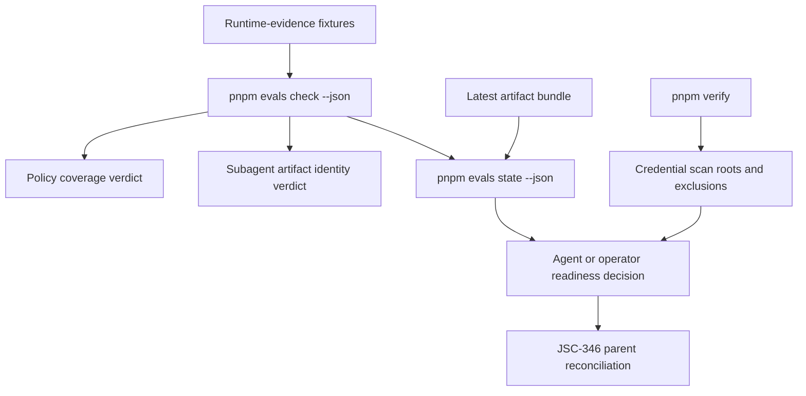
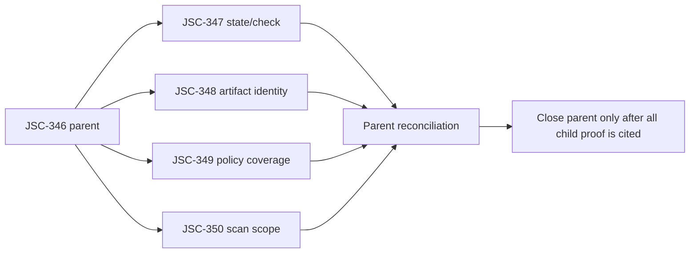

# Evals Runtime Evidence Trust Boundary Spec

## Command Summary

BLUF: This spec defines the behavior contract for the approved JSC-346 evals trust-boundary slice so each operator, developer, and future agent can trust the repo's local proof signals. It closes the most urgent runtime-evidence gaps found in the 2026-05-22 codebase audit because readiness can be overstated when runtime-evidence fixtures are broken, subagent artifact events can pass without proving artifact identity, and schema-shaped policy fields can look authoritative without scorer enforcement. The decision is to fix only the deterministic proof boundary now: state/check agreement, artifact identity matching, runtime-evidence policy coverage, and credential scan scope. The main risks are phase drift and contract drift, so this spec must not open dashboards, source mining, external adapters, packaged runtime launchers, plugin systems, LLM judge authority, or silent JSON shape changes. The next step is for he-plan to turn these acceptance IDs into bounded implementation units, starting with the smallest artifact-identity or policy-coverage patch and re-verifying live Linear state before any parent closeout.

Decision Needed: None for specification. The 2026-05-22 Linear plan records JSC-346 through JSC-350 as created; implementation closeout must re-check live Linear state and reconcile the AGENTS.md tracker override as historical unless or until the parent issue recovery condition creates or links a live issue.

Top Risks:

- False readiness: an agent may trust pnpm evals state --json even when pnpm evals check --json would reject runtime-evidence fixtures.
- False success: a subagent artifact contract may pass from event counts without proving the expected artifact path and type.
- Phase drift: broad runtime launcher, source-mining, dashboard, adapter, or judge work would weaken the current executable-spine boundary before deterministic contracts are stable.

Next Action: Hand this reviewed spec to he-plan for a four-child execution plan mapped to JSC-347 through JSC-350.

## Purpose

This document makes the approved runtime-evidence trust-boundary work testable before implementation. It converts the audit findings and created Linear issue tree into stable requirements, acceptance criteria, validation gates, and refusal triggers.

The spec covers only the parent execution slice tracked by JSC-346 and its four children.

| Linear Issue | Spec Role | Primary Gap |
|---|---|---|
| JSC-347 | State/check readiness alignment | GAP-001 / CONTRADICTION-001 |
| JSC-348 | Subagent artifact identity proof | GAP-003 / CONTRADICTION-003 |
| JSC-349 | Runtime-evidence policy coverage enforcement | GAP-002 / CONTRADICTION-002 |
| JSC-350 | Credential scan proof-surface coverage | GAP-011 / CONTRADICTION-004 |

## Problem Statement

The evals repo can run a synthetic fixture, write a local artifact bundle, validate latest-run evidence, and run deterministic checks. That is a real executable spine. The problem is that some newer runtime-evidence surfaces can still look more complete than they are.

From an operator perspective, the risk is not that the repo lacks ambition. The risk is that a future agent or reviewer sees a ready state, a passing runtime-evidence case, or a credential-scanned CI gate and treats that as stronger proof than the code actually provides. The highest-risk examples are state output that omits runtime-evidence suite health, subagent artifact scoring that counts events instead of matching artifact identity, and policy fields in fixtures that no scorer evaluates.

The requested fix is therefore a trust-boundary hardening slice, not a platform expansion.

## User / Operator Scenarios

### Scenario 1: Agent Checks Whether Evals Is Ready

A future agent runs pnpm evals state --json to decide whether the local proof surface is ready. If runtime-evidence validation would fail, the state packet must surface that failure and must not allow a ready interpretation.

Mapped requirements: FR-001, FR-004.  
Mapped acceptance: SA-001, SA-003.

### Scenario 2: Reviewer Verifies Subagent Artifact Evidence

A reviewer inspects a runtime-evidence fixture that says a subagent was expected to write an artifact. The scorer must prove the observed artifact event matches the expected subagent, artifact type, and artifact path. A bare ArtifactWritten count is not enough.

Mapped requirements: FR-002, FR-006.  
Mapped acceptance: SA-002.

### Scenario 3: Maintainer Adds a Runtime-Evidence Policy Field

A maintainer adds or modifies goal, thread, network, package provenance, permission, plugin, or subagent policy data in a runtime-evidence fixture. The check command must identify whether the declared policy family is enforced, explicitly scaffolded, or missing enforcement because it has no scorer coverage.

Mapped requirements: FR-003, FR-006.  
Mapped acceptance: SA-003.

### Scenario 4: CI Verifies Proof Surfaces for Secret-Like Text

A maintainer adds audit, spec, test, source, or fixture content. pnpm verify must either scan that proof-bearing surface for credential-like strings or document and test why the surface is excluded.

Mapped requirements: FR-005, NFR-003.  
Mapped acceptance: SA-004.

### Scenario 5: Parent Issue Closeout Reconciles Child Work

After one child issue closes, the parent implementation loop must still know which child is complete, which validation command proved it, and which next child remains. A single child closeout cannot be treated as completion of JSC-346.

Mapped requirements: DG-001.  
Mapped acceptance: SA-005.

## Goals

- Make pnpm evals state --json and pnpm evals check --json agree on runtime-evidence health.
- Require subagent artifact proof to match artifact identity, not just event counts.
- Make runtime-evidence policy coverage explicit and fail closed when a declared policy family is unscored without scaffold metadata.
- Expand or explicitly codify credential scan coverage for proof-bearing repo surfaces.
- Keep every fix local, deterministic, schema-backed where appropriate, and compatible with the phase-one executable spine.
- Preserve the parent/child implementation loop for JSC-346 through JSC-350.

## Non-Goals

- Do not build dashboards, trend views, or UI reporting.
- Do not add source-mining automation from real sessions or rollouts.
- Do not add external project adapters or runtime dependencies on coding-harness or agent-skills.
- Do not add a packaged Codex runtime launcher.
- Do not add plugin systems or hook execution as runtime authority.
- Do not make telemetry, traces, PR comments, or LLM judge text pass/fail authority.
- Do not reopen JSC-342 or JSC-345 unless Jamie separately requests historical tracker mutation.
- Do not solve every audit gap in this parent slice.

## Current State / Evidence

The source audit found a mature but incomplete local proof system. The strongest existing surfaces are local schemas, deterministic scorers, latest-run checks, trace event timeline validation, and pnpm verify in CI. The gaps selected for JSC-346 are the false-readiness and false-success paths that can mislead future automation.

| Evidence | Current State | Spec Consequence |
|---|---|---|
| Audit GAP-001 | src/lib/runtime-state.js derives state from latest-run validation while src/commands/validation.js also checks runtime-evidence cases. | State must include runtime-evidence validation health or must downgrade readiness when it fails. |
| Audit GAP-003 | src/lib/runtime-evidence-contract.js counts ArtifactExpected and ArtifactWritten by subagent. | Artifact events must match identity fields. |
| Audit GAP-002 | schemas/runtime-evidence-case.schema.json models more policy families than the scorer registry enforces. | Policy family coverage must be explicit and enforceable. |
| Audit GAP-011 | scripts/verify.js scans fixtures and .harness/evals, while new proof artifacts live under .harness/research. | Credential scan roots must cover proof-bearing surfaces or make exclusions intentional and tested. |
| Linear plan and live lookup | JSC-346 through JSC-350 are created; live lookup on 2026-05-22 confirmed the issues exist and remain unstarted/Todo. | This spec can use live Linear IDs but must keep project assignment empty and re-verify live tracker state at closeout. |
| AGENTS.md | Phase-one hard blocks reject dashboards, adapters, cloud, plugin systems, source mining, judge gates, and sibling-runtime dependencies; it also contains an older tracker override for the previous evals parent. | Scope must stay offline and deterministic; tracker claims must cite the newer live Linear plan plus a closeout recheck, not stale instruction text alone. |
| Deep module fix mechanics | Each selected gap needs an owner module, public interface, hidden implementation rule, seam test, tracer proof, rollback path, and validation gate. | he-plan must produce deep module fix packets before runtime edits. |

## Proposed Behavior

### User-Facing Solution

Operators and future agents should be able to run the repo's existing local commands and get honest, consistent evidence. If runtime-evidence cases fail, both the check command and state packet should make that visible. If a subagent artifact is expected, the runtime-evidence verdict should prove the expected artifact identity. If a fixture declares a policy family, the check output should say whether that family is enforced, explicitly scaffolded, or invalid. If CI claims credential scanning as part of pnpm verify, proof-bearing source and harness surfaces should be covered or deliberately excluded with a tested reason.

### Runtime-Evidence Trust Boundary

The trust boundary is the set of local artifacts and commands that a future agent may cite as proof:

- pnpm evals check --json
- pnpm evals state --json
- pnpm verify
- runtime-evidence fixtures under fixtures/runtime-evidence
- runtime-evidence schema and scorer outputs
- latest-run and artifact bundle validation

The boundary MUST remain local and deterministic. Telemetry may explain failures, but the artifact bundle, schema validation, scorer outputs, and CI gate decide whether work is acceptable.

This spec and the Linear issue tree are traceability inputs. They may explain why work exists and how it is routed, but they are not runtime proof authority.

## Requirements

### Functional Requirements

| ID | Requirement | Linear Trace |
|---|---|---|
| FR-001 | pnpm evals state --json MUST include runtime-evidence suite health through the versioned runtime-state contract, or through a reviewed replacement that preserves the same machine-readable semantics, whenever pnpm evals check --json evaluates runtime-evidence fixtures. | JSC-347 |
| FR-002 | Runtime-evidence subagent artifact scoring MUST require matching subagent_id, artifact type, and artifact path for expected and written artifact events. | JSC-348 |
| FR-003 | Runtime-evidence validation MUST classify each declared policy family as implemented_enforced, scaffolded_not_enforced, or missing_enforcement, and MUST fail when an unscored family is declared without explicit scaffold status and the required scaffold reason. | JSC-349 |
| FR-004 | State readiness MUST NOT be ready or equivalent when runtime-evidence contract validation fails. | JSC-347 |
| FR-005 | pnpm verify MUST scan proof-bearing repo surfaces for credential-like strings or MUST expose a documented and tested exclusion list. | JSC-350 |
| FR-006 | Runtime-evidence validation errors MUST name the failing contract surface clearly enough for a maintainer to identify whether the failure is schema shape, scorer coverage, artifact identity, permission drift, or plugin attribution. | JSC-348, JSC-349 |

### Delivery Governance Requirements

These requirements govern closeout evidence for the implementation program. They are not runtime proof authority and must not expand the JSC-347 through JSC-350 implementation scope.

| ID | Requirement | Linear Trace |
|---|---|---|
| DG-001 | Parent closeout for JSC-346 MUST cite child issue completion, exact validation commands, remaining child status, and a fresh live Linear recheck; closing one child MUST NOT imply parent completion. | JSC-346 |

### Non-Functional Requirements

| ID | Requirement | Rationale |
|---|---|---|
| NFR-001 | The implementation MUST stay within phase-one hard blocks: no dashboards, external adapters, cloud runners, telemetry exporters as authority, plugin systems, source-mining automation, required LLM judge gates, or sibling repo runtime dependencies. | Preserves executable-spine doctrine. |
| NFR-002 | CLI JSON compatibility SHOULD be additive where practical, and existing top-level state status values MUST remain consumer-safe. Any new required field, status enum change, or breaking output shape MUST update the relevant schema version, schema tests, and implementation evidence. | Protects future agent consumers. |
| NFR-003 | Credential scan changes MUST remain deterministic and avoid generated dependency directories. | Keeps pnpm verify suitable for CI. |
| NFR-004 | Validation SHOULD use the smallest relevant command first, then broader gates when the touched surface requires them. | Matches repo closeout guidance. |
| NFR-005 | Error output SHOULD favor precise machine-readable fields over prose-only explanation. | Keeps artifacts authoritative. |

## Interfaces

### CLI Interfaces

| Command | Contract Change | Compatibility Rule |
|---|---|---|
| pnpm evals check --json | Must validate runtime-evidence policy coverage and artifact identity. | Must expose policy coverage in one canonical machine-readable location; any emitted JSON shape change needs schema or golden-output tests. |
| pnpm evals state --json | Must reflect runtime-evidence contract health and downgrade readiness on failure. | Existing top-level status enum must remain consumer-safe; any new field requires runtime-state schema/version and compatibility tests. |
| pnpm verify | Must scan or intentionally exclude proof-bearing surfaces. | Must remain deterministic and CI-safe. |

### Module Interfaces

| Module | Public Interface | Hidden Implementation Rule |
|---|---|---|
| src/lib/runtime-state.js | Runtime state packet builder used by pnpm evals state --json. | Callers should not need to run check separately to know whether runtime-evidence contracts are unhealthy. |
| src/lib/runtime-evidence-contract.js | Runtime-evidence suite/case validation and scorer contract. | Callers should not manually compare policy families, expected artifacts, and observed events. |
| scripts/verify.js | pnpm verify aggregate gate. | Callers should not maintain separate secret-scan root knowledge outside the verifier. |

## Data / Domain Contract

### Runtime-Evidence Policy Coverage

A runtime-evidence validation result MUST expose policy coverage in one canonical machine-readable location. The preferred location for this slice is a schema-backed object reachable from pnpm evals check --json as runtime_evidence.policy_coverage. If the current command envelope cannot safely add that path, implementation must stop for a shared contract decision rather than placing equivalent data in multiple ad hoc locations.

Schema and versioning rule:

- Do not mutate existing closed fixture enums or output fields silently.
- If runtime-evidence fixture schema changes are needed, bump or explicitly revise the relevant schema version and add compatibility tests for existing valid fixtures.
- If check output gains a new object, add golden JSON or schema-backed contract tests so downstream consumers can detect accidental drift.
- Policy coverage status is validation output. It must not be confused with the audit runtime-status vocabulary used in research documents.

Required field semantics:

| Field Concept | Required | Allowed Values / Shape | Compatibility |
|---|---|---|---|
| policy family name | yes | stable string such as permissions, subagent_artifacts, plugin_attribution, goal, thread, network, or package_provenance | New families may be additive only with unknown-family tests. |
| enforcement status | yes | implemented_enforced, scaffolded_not_enforced, or missing_enforcement | New statuses are breaking unless schema/tests are updated. |
| scorer owner | required for enforced families | scorer identifier or module-local owner name | Missing owner is invalid for enforced families. |
| scaffold reason | required for scaffolded families | short string or reference explaining why non-enforcement is intentional | Missing reason is invalid for scaffolded declarations. |
| failure reason | required for missing enforcement | stable error code plus human-readable message | Error code should be preferred by tests. |

Unknown-field behavior: validation MAY tolerate unknown optional fields in output if the schema allows additive fields, but it MUST NOT ignore unknown policy families declared by fixtures without classifying them. If the fixture/schema cannot express scaffolded_not_enforced plus the required scaffold reason, an unscored declared policy family MUST remain missing_enforcement.

Minimum policy-family mapping:

| Policy Family | Current / Expected Scorer ID | Failure Class | Default Error Code |
|---|---|---|---|
| permissions | permission-drift | permission drift or missing permission scorer | RTE_POLICY_PERMISSION_UNSCORED |
| subagent_artifacts | subagent-artifact-contract | artifact identity or missing artifact scorer | RTE_POLICY_SUBAGENT_ARTIFACT_UNSCORED |
| plugin_attribution | plugin-attribution | plugin attribution or missing plugin scorer | RTE_POLICY_PLUGIN_UNSCORED |
| goal | none in current slice | missing enforcement unless explicitly scaffolded | RTE_POLICY_GOAL_UNSCORED |
| thread | none in current slice | missing enforcement unless explicitly scaffolded | RTE_POLICY_THREAD_UNSCORED |
| network | none in current slice | missing enforcement unless explicitly scaffolded | RTE_POLICY_NETWORK_UNSCORED |
| package_provenance | none in current slice | missing enforcement unless explicitly scaffolded | RTE_POLICY_PACKAGE_PROVENANCE_UNSCORED |

### Subagent Artifact Event Identity

For artifact contract scoring, ArtifactExpected and ArtifactWritten events MUST carry enough identity to match the obligation. The canonical artifact identity for this slice is artifact_ref, defined as normalized artifact_type plus normalized artifact_path. Implementation may store those fields separately, but the scorer must join expected and written events on the equivalent of:

artifact_ref = normalize(artifact_type) + ":" + normalize(artifact_path)

Required matching dimensions:

| Dimension | Required For Artifact Events | Notes |
|---|---|---|
| subagent_id | yes | Existing count-based owner remains necessary but insufficient. |
| artifact type | yes | Name may be artifact_type or a schema-approved equivalent. |
| artifact path | yes | Path must be repo-relative or explicitly fixture-relative according to the runtime-evidence schema, normalized before matching. |
| event type | yes | Must distinguish expected from written events. |
| artifact_ref | derived or explicit | Canonical identity key for matching; if explicit, it must agree with type/path. |

Error handling:

- Missing artifact identity MUST fail validation.
- A written artifact with the wrong path MUST fail validation.
- Duplicate or ambiguous written events MUST fail with an artifact-identity ambiguity error unless they are exact duplicate observations of the same event identifier and that idempotent behavior is covered by tests.
- Path traversal MUST be rejected if artifact paths are later used for filesystem reads.

### Runtime State Contract

The runtime state packet MUST make contract health visible. Because schemas/runtime-state.schema.json currently has schema_version 1 and additionalProperties: false, adding a new object requires an explicit schema/version update or an equivalent tested compatibility strategy.

Preferred contract for this slice:

| Field | Required Shape | Notes |
|---|---|---|
| schema_version | bump required if new fields are emitted | Version 1 cannot accept new top-level fields without schema changes. |
| contract_health.runtime_evidence.status | ready, failing, unavailable, or not_configured | failing and unavailable must prevent ready interpretation. |
| contract_health.runtime_evidence.failure_codes | array of stable strings | Include policy, artifact identity, schema, or validator failure codes. |
| contract_health.runtime_evidence.checked_by | command or module identifier | Should point to the shared runtime-evidence validator, not duplicated logic. |
| non_ready_reason_code | stable string when status is not ready | Lets old and new consumers distinguish latest-run failure from contract failure. |

The existing top-level status enum remains ready, stale, missing, or invalid unless a later shared decision changes it. Runtime-evidence contract failure should map top-level status to invalid, include pnpm evals check --json in recommended_commands, and expose the contract-specific reason through the versioned contract-health fields.

The data contract must support:

| Concept | Required | Consumer Behavior |
|---|---|---|
| latest artifact validation status | yes | Existing behavior remains. |
| runtime-evidence validation status | yes | Must affect readiness through the shared validator. |
| failing contract families or cases | required on failure | Enables targeted repair. |
| recommended validation commands | yes | Must include pnpm evals check --json when contract validation fails. |
| stale or unavailable reason | required when not ready | Prevents optimistic closeout. |

### Credential Scan Target Contract

pnpm verify MUST own its scan roots and exclusions.

Required field or code-level concepts:

| Concept | Required | Rule |
|---|---|---|
| included roots | yes | Target roots: fixtures, schemas, src, scripts, test, tests, .harness/evals, .harness/research, .harness/specs, .harness/plan, and .harness/linear when present. |
| excluded roots | yes when any broad root is scanned | Must avoid .git, node_modules, package-manager stores, dist, build, coverage, binary media, and any high-volume generated directory. |
| fallback scanner | yes | Existing Node fallback must remain or be replaced with equivalent deterministic behavior using the same include/exclude contract as rg. |
| failure shape | yes | Must name path and matched pattern class without leaking unnecessary content. |

The target roots are not permission to apply the existing broad prose keyword regex blindly. A dry-run expanded scan currently reports documentation/source matches for words such as secret and token, so implementation MUST add tested pattern classes, false-positive handling, or explicit exclusions before claiming SA-004. Any exclusion of .harness/evals/runs, latest-run artifacts, or other proof-bearing generated output requires a tested reason because those paths can be closure evidence.

## Enforcement Contract

essential_decisions:

- The runtime-evidence contract remains local and deterministic.
- pnpm evals check --json is the primary runtime-evidence validation authority for this slice.
- pnpm evals state --json must not report readiness weaker than check for runtime-evidence health.
- Subagent artifact proof requires artifact identity, not just event counts.
- Declared policy families require scorer coverage or explicit scaffold status.
- pnpm verify owns credential scan coverage for committed proof surfaces.
- No phase-one hard-blocked capability is opened by this spec.

fillable_gaps:

- Exact JSON field names for added state/check coverage objects.
- Exact error code naming.
- Fixture names and fixture layout for positive and negative cases.
- Whether policy coverage is reported per case, per suite, or both, as long as the canonical JSON location remains runtime_evidence.policy_coverage or a single reviewed replacement.
- Whether scan roots are represented as constants, config, or inline verifier definitions.

guardrails:

- pnpm test
- pnpm evals check --json
- pnpm evals state --json
- pnpm verify
- Runtime-evidence negative fixtures for missing artifact path, wrong artifact path, and unscored policy family.
- Runtime-evidence negative fixture or unit test for ambiguous duplicate artifact writes.
- Golden JSON or schema-backed contract tests for pnpm evals check --json and pnpm evals state --json when output shape changes.
- Schema validation for any changed runtime-state or runtime-evidence output.
- Parent/child loop reconciliation before closing JSC-346, including a fresh live Linear recheck.

refusal_triggers:

- A fix requires new public CLI semantics that cannot be made additive or schema-backed.
- A fix adds runtime-state or check-output fields without schema/version or golden-output coverage.
- A fix requires source-mining automation, external adapters, packaged runtime launcher work, cloud execution, plugin systems, or LLM judge gates.
- A fixture policy family needs a new domain decision that source evidence does not support.
- Credential scanning would require secret access, external scanning services, or broad filesystem reads outside the repo.
- The implementation cannot identify an owner module and seam test for a selected gap.

durable_memory:

- Durable spec: .harness/specs/2026-05-22-jsc-346-runtime-evidence-trust-boundary-spec.md
- Audit source: .harness/research/audits/2026-05-22-evidence-led-codebase-gap-audit.md
- Linear plan: .harness/linear/2026-05-22-evals-runtime-evidence-enforcement-linear-plan.md
- Implementation evidence should land in the relevant PR body, child issue closeout, and closure/eval artifact if behavior changes.

professional_output:

- Closeout must list files changed, exact validation commands, pass/fail/blocker state, remaining warnings, Linear child status, live tracker recheck result, and parent-loop next action.
- Any blocked validation must be reported as blocked with the exact reason.
- A child issue closeout must not claim JSC-346 completion unless all children and parent validation are reconciled.

## Security, Privacy, and Safety

This spec improves safety by preventing overstated evidence and widening credential scan coverage for proof surfaces. It does not authorize secret access, external scanning services, or mining of real user sessions.

Security requirements:

- Credential scanning MUST avoid printing full secret-like values when reporting failures.
- Fixture and artifact path validation MUST reject traversal before any future filesystem reads use those paths.
- Runtime-evidence policy widening is outside this slice except where policy coverage requires explicit scaffold or missing-enforcement status.
- Real session mining remains out of scope. Manual promotion schema work is deferred to a later issue.
- Scanner root expansion MUST avoid node_modules, package-manager stores, generated run artifacts that are intentionally external, binary/unreadable files without classified handling, and other high-volume generated directories.
- Scanner root expansion MUST preserve detection of credential-shaped tokens while classifying or excluding documentation prose matches with tests.

Privacy requirements:

- No raw Codex sessions, rollouts, connector payloads, or user secrets may be imported by this slice.
- The credential scan must cover new audit/spec/research surfaces or explicitly test why a surface is excluded.

Safety requirements:

- The repo must fail closed when a runtime-evidence fixture claims more policy authority than the scorer registry provides.
- The state packet must not invite automation to proceed when runtime-evidence validation is unhealthy.

## Accessibility and Operator Ergonomics

No UI is introduced. Accessibility is operator-facing and command-output focused.

- JSON output should remain machine-readable and stable enough for agents.
- Error messages should be concise and name the failing surface.
- Recommended commands in state output should be actionable without requiring the operator to infer the next validation gate.
- Human-readable reports may explain failures, but the JSON and artifact evidence remain the source of truth.
- Status values should not rely on color or formatting.

## Failure and Recovery

| Failure | Expected Classification | Recovery |
|---|---|---|
| Runtime-evidence fixture has unscored declared policy | validation failure | Add enforcing scorer, remove unsupported policy declaration, or mark scaffolded with required reason if allowed. |
| Artifact event lacks path/type identity | validation failure | Add required identity fields or adjust fixture to match schema. |
| state --json cannot evaluate runtime-evidence health | not ready or contract validation unavailable | Report unavailable reason and recommend pnpm evals check --json. |
| Credential scanner finds secret-like content | verification failure | Remove or redact content, or add tested false-positive handling if safe. |
| Credential scanner cannot scan a configured root | verification failure unless explicitly excluded | Fix path handling or document/test exclusion. |
| One child issue is complete but siblings remain open | parent still active | Reconcile JSC-346, recheck live Linear state, and select the next child. |

Rollback paths:

- Runtime-state changes can revert to previous latest-run-only status if the new contract shape is wrong, but JSC-347 remains open until a replacement state/check alignment is specified.
- Runtime-evidence scorer changes can revert individual fixture/schema additions if they overconstrain existing valid cases, but count-only artifact scoring must not be treated as complete.
- Credential scan expansion can narrow roots only with explicit documented/tested exclusions.

## Validation Plan

Validation must be layered from narrow seam tests to repo gates.

| Acceptance | Required Validation | Expected Proof |
|---|---|---|
| SA-001 | pnpm test; pnpm evals state --json; pnpm evals check --json | Broken runtime-evidence fixture affects both check and state readiness. |
| SA-002 | pnpm test; pnpm evals check --json | Missing, wrong, or ambiguous artifact identity fails; correct identity passes. |
| SA-003 | pnpm test; pnpm evals check --json | Unscored policy declaration fails or is explicitly scaffolded. |
| SA-004 | pnpm test; pnpm verify; EVALS_VERIFY_FORCE_NODE_CREDENTIAL_SCAN=1 node scripts/verify.js when fallback behavior changes | Credential scan covers proof surfaces with rg and fallback parity, tested exclusions, and tested false-positive handling for documentation/source prose. |
| SA-005 | Issue closeout evidence plus relevant commands | Parent loop records child completion, next child status, and live tracker recheck. |

Test quality rules:

- Tests should target externally observable command behavior or exported module contracts, not private helper choreography.
- Negative fixtures must fail before the fix and pass after the intended behavior is implemented.
- Any changed schema must be exercised by at least one positive and one negative case where practical.
- Any changed public JSON output must have a golden-output or schema-backed compatibility test.
- Runtime-state schema changes must test that existing top-level status values remain consumer-safe.
- pnpm verify should be run after credential scan changes because it is the CI gate.
- Broader gates are required before parent closeout, even if child work uses narrower commands first.

## Acceptance Criteria

| ID | Acceptance Criteria | Linear Trace |
|---|---|---|
| SA-001 | Given a schema-valid runtime-evidence fixture or suite state that fails the runtime-evidence contract, pnpm evals check --json fails and pnpm evals state --json reports a non-ready contract state with a recommended check command. | JSC-347 |
| SA-002 | Given subagent artifact events missing artifact path/type, using the wrong artifact path, or producing ambiguous duplicate written events, runtime-evidence validation fails; given matching subagent_id, artifact type, and artifact path, it passes. | JSC-348 |
| SA-003 | Given a runtime-evidence fixture declaring a policy family with no enforcing scorer and no explicit scaffold status, pnpm evals check --json fails with a machine-readable policy coverage error at runtime_evidence.policy_coverage or a reviewed replacement with equivalent schema coverage. | JSC-349 |
| SA-004 | pnpm verify scans the canonical proof roots named in the credential scan target contract, including .harness/research, src, test, and tests when present, or it includes tested exclusions that explicitly justify any omitted proof-bearing surface; rg and fallback behavior use the same root/exclusion contract. | JSC-350 |
| SA-005 | JSC-346 closeout cites JSC-347 through JSC-350 status, exact validation outcomes, remaining risk, live tracker recheck result, and the parent-loop reconciliation decision. This is delivery governance acceptance, not runtime proof acceptance. | JSC-346 |

## Visual References / Diagrams

### Trust-Boundary Flow

### Parent / Child Closure Boundary

## Implementation Notes

These notes define durable implementation decisions and handoff constraints. They are not task order.

### Deep Module Fix Packet Skeletons

| Gap | Owner Module | Public Interface | Hidden Implementation | Seam Test | Tracer Proof | Rollback |
|---|---|---|---|---|---|---|
| GAP-003 | src/lib/runtime-evidence-contract.js | runtime-evidence validation via pnpm evals check --json | Artifact obligation matching by identity | Missing path and wrong path fixture tests | pnpm evals check --json | Revert scorer change while keeping JSC-348 open |
| GAP-002 | src/lib/runtime-evidence-contract.js plus schema if needed | policy coverage status in check output | Scorer registry maps policy families to coverage state | Unscored policy fixture fails | pnpm evals check --json | Revert coverage gate, preserve fixture evidence |
| GAP-001 | src/lib/runtime-state.js | pnpm evals state --json | State builder owns runtime-evidence health lookup | Broken runtime-evidence fixture downgrades state | pnpm evals state --json and pnpm evals check --json | Revert state field addition, keep check gate authoritative |
| GAP-011 | scripts/verify.js | pnpm verify | Verifier owns scan roots and exclusions | Scan-root contract test | pnpm verify | Narrow roots only with tested/documented exclusions |

### Recommended Implementation Shape

- Prefer table-driven coverage metadata in runtime-evidence-contract.js before adding a general policy engine.
- Prefer explicit code checks for artifact event identity because the repo's local JSON Schema subset does not support conditional schema keywords.
- Prefer additive runtime-state fields unless a readiness status semantic must change to prevent false confidence.
- If runtime-state output adds contract_health, update schemas/runtime-state.schema.json and add compatibility tests because the current schema rejects additional properties.
- Prefer verifier constants or a small config object for credential scan roots; avoid scanning generated dependencies.
- Start PU-004 with an expanded-scope dry run so prose false positives are classified before verifier roots are widened.

## Open Questions

No implementation-blocking questions remain for the JSC-346 slice.

Non-blocking verification dependencies:

- Live Linear state still requires closeout-time recheck because AGENTS.md records the older 2026-05-18 tracker override while the 2026-05-22 Linear plan records JSC-346 through JSC-350 as created.
- Public JSON field names are governed by the Data / Domain Contract and Interfaces sections. Implementation may choose only internal helper names freely. If implementation cannot preserve the named public contract without a schema version, enum, or CLI-breaking output change, it must stop for a shared decision before proceeding.

## Decision

Proceed with the JSC-346 trust-boundary slice as a deterministic local proof hardening program.

The first he-plan should preserve the Linear child boundaries. The order below is a recommendation, not a substitute for he-plan sequencing:

1. JSC-348 or JSC-349 first, because scorer correctness is the smallest trust boundary.
2. JSC-347 after the check contract shape is stable.
3. JSC-350 independently or last, with pnpm verify as the final gate.
4. JSC-346 closes only after all children and parent reconciliation evidence are present.

## Evidence and References

| Source | Use |
|---|---|
| .harness/research/audits/2026-05-22-evidence-led-codebase-gap-audit.md | Primary source for gaps, contradictions, risks, and implementation order. |
| .harness/linear/2026-05-22-evals-runtime-evidence-enforcement-linear-plan.md | Live Linear parent/child topology and mutation evidence. |
| AGENTS.md | Phase-one hard blocks, validation contract, deep module fix mechanics, parent/child loop guardrail. |
| .harness/core/2026-05-18-evals-core.md | Doctrine: artifacts decide, telemetry explains, local deterministic spine first. |
| UBIQUITOUS_LANGUAGE.md | Runtime evidence contract, runtime state packet, artifact bundle, parent/child loop terminology. |
| .harness/refactors/2026-05-20-deep-module-fix-mechanics.md | Required fix packet shape before runtime edits. |
| .harness/refactors/2026-05-20-parent-child-loop-guardrail.md | Parent issue cannot close from a child loop alone. |

## Appendix A. Harness Metadata / Traceability

schema_version: 1  
interactive_status: complete_no_questions  
selection_evidence: JSC-346 through JSC-350 exist in the Linear plan with URLs and labels; live lookup on 2026-05-22 confirmed they still exist and are unstarted/Todo; closeout must re-verify live Linear state because AGENTS.md still contains an older tracker override.  
route: standard-spec  
stage: he-spec  
scope: Runtime evidence trust-boundary behavior for the approved JSC-346 execution slice.  
safe_to_continue: true  
blocked_reason: none  
linear_mutation_status: live_verified_2026-05-22  
linear_action_required: recheck_before_closeout  
spec_path: .harness/specs/2026-05-22-jsc-346-runtime-evidence-trust-boundary-spec.md  
acceptance_ids: SA-001, SA-002, SA-003, SA-004, SA-005  
git_staging_status: unstaged  
staged_paths: []  
confidence: 88%, strong candidate with validation gaps, based on current repo instructions, audit evidence, the live Linear plan artifact, focused technical review, and passing he-spec artifact-shape checks. Runtime implementation is not yet tested.

### Linear Acceptance Traceability

| Acceptance | Parent | Child | Validation |
|---|---|---|---|
| SA-001 | JSC-346 | JSC-347 | pnpm test; pnpm evals state --json; pnpm evals check --json |
| SA-002 | JSC-346 | JSC-348 | pnpm test; pnpm evals check --json |
| SA-003 | JSC-346 | JSC-349 | pnpm test; pnpm evals check --json |
| SA-004 | JSC-346 | JSC-350 | pnpm test; pnpm verify |
| SA-005 | JSC-346 | all children | Parent reconciliation evidence plus live tracker recheck |

### Blackboard Delta

- Deepened the tracked spec for the live JSC-346 runtime-evidence trust-boundary slice after technical review.
- Preserved JSC-342 and JSC-345 as prior Done context, not reopened scope.
- Confirmed no exact evals Linear project assignment; tracking remains label-based.
- Preserved phase-one hard blocks and source-mining deferral.
- Reconciled tracker evidence by treating the 2026-05-22 Linear plan as the source for JSC-346 while requiring a fresh live Linear recheck before closeout.

## Appendix B. Review Outcomes

Focused technical review was run after the initial spec draft. Findings were incorporated as follows:

| Reviewer | Finding | Resolution |
|---|---|---|
| scope-guardian-reviewer | Parent closeout criteria were mixed into runtime acceptance. | Recast parent closeout as DG-001 delivery governance and marked SA-005 as non-runtime acceptance. |
| scope-guardian-reviewer | Spec/Linear issue tree were included in the runtime trust boundary. | Removed them from runtime proof authority and kept them as traceability inputs. |
| feasibility-reviewer | Artifact identity lacked a canonical key and duplicate-event behavior. | Defined artifact_ref from normalized type/path and made ambiguous duplicates a MUST-fail case unless exact event-id idempotence is tested. |
| feasibility-reviewer | Credential scan boundary lacked canonical roots and fallback parity. | Added default include/exclude inventory and required rg/fallback parity. |
| feasibility-reviewer | Tracker state conflicted with older AGENTS tracker override. | Added tracker reconciliation language requiring live Linear recheck before closeout. |
| api-contract-reviewer | Policy coverage needed schema/version migration guidance. | Added schema/versioning rules, canonical output location, and compatibility-test requirements. |
| api-contract-reviewer | State readiness compatibility was underdefined. | Added preferred contract_health.runtime_evidence contract, schema_version rule, and top-level status mapping. |
| api-contract-reviewer | Policy family names and scorer IDs could drift. | Added minimum policy-family to scorer/error-code mapping. |

### No-Fog Gate

| Check | Status | Evidence |
|---|---|---|
| Exactly one opening BLUF | pass | Command Summary contains the only BLUF label. |
| Risks state consequences | pass | False readiness, false success, and phase drift are named. |
| Recommendations say what happens next | pass | Next Action routes to he-plan. |
| Do Not boundaries prevent real drift | pass | Non-Goals block phase-one expansion paths. |
| Validation claims cite commands | pass | Validation Plan maps acceptance to exact commands. |
| Visual aid clarifies boundary | pass | Mermaid diagrams show trust and parent/child boundaries. |
| Technical review findings resolved | pass | Appendix B maps reviewer findings to spec changes. |

## Appendix C. he-plan Handoff

he-plan should create implementation units that preserve these boundaries:

| Handoff Field | Value |
|---|---|
| Source spec | .harness/specs/2026-05-22-jsc-346-runtime-evidence-trust-boundary-spec.md |
| Parent issue | JSC-346 |
| Child issues | JSC-347, JSC-348, JSC-349, JSC-350 |
| First recommended child | JSC-348 or JSC-349 |
| Required acceptance IDs | SA-001 through SA-005 |
| Required validation gates | pnpm test, pnpm evals check --json, pnpm evals state --json, pnpm verify as scoped above |
| Stop condition | New public API/schema decision, phase-one hard-block request, or unclear scorer ownership |
| Handoff confidence | high |
