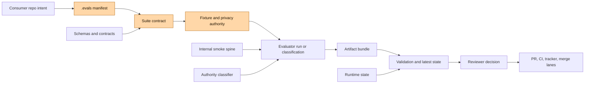

# Theory of Constraints Review: evals

Date: 2026-06-11
Repository: /Users/jamiecraik/dev/evals
Review mode: Theory of Constraints review using Goldratt's system lens, chaos engineering, trustworthy controlled experiments, measurement theory, context-driven software testing, and AI-eval operations
Audience: evals maintainers, platform owners, and downstream repo operators

## Executive Summary

The current constraint in evals is not test execution, schema discipline, or local artifact production. Those are comparatively strong. The constraint is the adoption and observation boundary between this repository and the consumer repositories it is meant to evaluate.

Evals has built a credible executable proof spine: schemas, deterministic smoke cases, artifact manifests, latest-run checks, runtime state, authority classification, and CI-equivalent verification. It can say, with unusually high precision, what its own evidence proves and does not prove.

But the system's throughput is defined by independently useful external evaluations. On that measure, the bottleneck is that consumer repos do not yet declare enough black-box evaluation intent, fixture authority, privacy posture, or adoption state through the evals contract. The repo can verify its own spine, but it cannot yet consistently convert external project behavior into trusted examiner-grade verdicts.

The additional evaluation-science lenses sharpen that conclusion:

- Chaos engineering says evals needs explicit steady-state hypotheses and controlled failure injection, not only after-the-fact artifact validation.
- Trustworthy controlled experimentation says evals needs stronger unit-of-analysis, metric, guardrail, and interference discipline before cross-repo comparisons become credible.
- Measurement theory says evals should quantify uncertainty reduction and value of information, not only produce pass/fail packets.
- Context-driven testing says evals needs chartered exploration, diverse oracles, risk-based coverage, and bug-advocacy style evidence, not only automated regression checks.
- AI-eval practice says evals needs trace-first datasets, error analysis before judge construction, calibrated LLM judges, safety guardrails, and production drift loops.

The highest-leverage move is therefore not to add more internal machinery. It is to exploit the existing adoption constraint: make one consumer path, starting with coding-harness, produce a small, explicit, repo-owned .evals manifest and one or two examiner-style suites that evals can run or classify without knowing implementation internals. The first suite should also declare its steady-state expectation, decision metric, `suite_quality.residual_uncertainty`, and `suite_quality.guardrail_metrics`. There is no dedicated failure-injection manifest field in the current contract; failure injection should stay inside an approved suite case or remain out of scope until a schema change explicitly adds it. Once that path is boring, repeat it across agent-skills, session-collector, and telemetry surfaces.

## Evidence Base

This review used current repository evidence, not memory alone:

- AGENTS.md
- .harness/core/2026-05-18-evals-core.md
- UBIQUITOUS_LANGUAGE.md
- README.md
- ARCHITECTURE.md
- CONTRIBUTING.md
- package.json
- .harness/ci-required-checks.json
- schemas/
- fixtures/
- contracts/
- src/
- test/
- .harness/specs/
- .harness/research/audits/
- pnpm evals --help
- pnpm evals state --json
- current file inventory and line-count snapshots
- read-only comparison against /Users/jamiecraik/dev/coding-harness package scripts and eval/artifact surfaces
- search for .evals/project.json in coding-harness, agent-skills, session-collector, and otel-collector roots
- The Goal, Eliyahu M. Goldratt, used as the Theory of Constraints source frame
- Chaos Engineering, Casey Rosenthal and Nora Jones, used as a systems-resilience lens
- Trustworthy Online Controlled Experiments, Ron Kohavi, Diane Tang, and Ya Xu, used as an experiment-validity lens
- How to Measure Anything, Douglas Hubbard, used as a measurement and uncertainty-reduction lens
- Lessons Learned in Software Testing, Cem Kaner, James Bach, and Bret Pettichord, used as a context-driven testing lens
- AI Evals For Engineers, PMs & QAs: Complete Study Guide, used as an AI-eval operations lens

Downstream manifest search evidence:

```bash
fd -a '^project\\.json$' /Users/jamiecraik/dev/coding-harness/.evals /Users/jamiecraik/dev/coding-harness
fd -a '^project\\.json$' /Users/jamiecraik/dev/agent-skills/.evals /Users/jamiecraik/dev/agent-skills
fd -a '^project\\.json$' /Users/jamiecraik/.agents/session-collector/.evals /Users/jamiecraik/.agents/session-collector
fd -a '^project\\.json$' /Users/jamiecraik/.agents/otel-collector/.evals /Users/jamiecraik/.agents/otel-collector
```

All four commands returned exit 0 with empty output during the 2026-06-13 validation pass, so no .evals/project.json adoption manifests were observed in the sampled coding-harness, agent-skills, session-collector, or otel-collector roots. That is the most important live adoption signal in this review.

Attachment validation update:

- Direct text extraction succeeded for The Goal, Chaos Engineering, Trustworthy Online Controlled Experiments, How to Measure Anything, and the AI evals study guide.
- The Lessons Learned in Software Testing PDF is scanned page images. OCR using qpdf, ocrmypdf, and Tesseract succeeded on a selected body-page sample, though OCR quality is imperfect on front matter and rotated or ornamental pages.
- The review now treats the attachment set as validated against extracted text or OCR-supported text samples, not only as conceptual summaries.

## Attachment Validation Map

This validation pass checked the review against source-specific themes extracted from the attachments:

| Attachment                                | Extraction status           | Source themes confirmed                                                                                                                                                            | Review implication                                                                                                       |
| ----------------------------------------- | --------------------------- | ---------------------------------------------------------------------------------------------------------------------------------------------------------------------------------- | ------------------------------------------------------------------------------------------------------------------------ |
| The Goal                                  | Direct text extraction      | throughput, inventory, operational expense, constraint and bottleneck logic, local optimization risk                                                                               | Keep adoption as the system constraint and measure value by external decisions enabled, not internal artifact volume.    |
| Chaos Engineering                         | Direct text extraction      | experimentation versus testing, hypotheses around steady-state behavior, context, safety, automated and continuous experiments, CI/CD chaos experiments                            | Name fail-closed fixture cases as bounded resilience experiments with explicit steady-state hypotheses and blast radius. |
| Trustworthy Online Controlled Experiments | Direct text extraction      | hypotheses, key metrics, Overall Evaluation Criterion, guardrails, trustworthiness checks, Twyman's law, Simpson's paradox, carryover effects, network interactions                | Add experiment-design metadata before cross-repo or agent comparisons become authoritative.                              |
| How to Measure Anything                   | Direct text extraction      | uncertainty, risk, calibrated estimates, value of information, random sampling, controlled experiments, human judges                                                               | Rank future eval work by uncertainty reduction and decision value, not by metric availability.                           |
| Lessons Learned in Software Testing       | OCR sample from scanned PDF | context-driven testing, exploratory testing, lessons are not universal best practices, pilot studies, risk of uncritical adoption                                                  | Add exploratory charters, oracle notes, coverage notes, and context checks before freezing consumer suites.              |
| AI evals study guide                      | Markdown text               | traces first, error analysis before judges, datasets, guardrails, safety, judge validation, TPR/TNR, false positives/false negatives, correction for judge error, production loops | Keep required LLM judges blocked in phase one while adding judge-readiness and trace-to-error-taxonomy metadata.         |

The validation did not require copying source text into this review. The review uses the books as lenses and keeps the repository's artifact authority boundaries intact.

## 1. Goals

### Current Goal

The current effective goal of the repository is to maintain a trustworthy executable spine for local evaluation evidence:

- canonical schemas;
- deterministic scorer contracts;
- artifact bundles;
- latest-run validation;
- runtime state reporting;
- authority-boundary classification;
- proof that local validation is not CI truth, review truth, tracker truth, or merge readiness.

This goal is coherent and valuable. It gives the repo a strong internal definition of evidence.

### Desired Goal

The desired goal should be:

Make evals the independent examiner layer that consumer repositories can use to declare, run, and preserve evidence for behavior, quality, challenge, and readiness claims without depending on the consumer implementation's internal opinion of itself.

That means evals should optimize for examiner throughput:

- more consumer repos declaring evaluation intent through explicit manifests;
- more black-box or implementation-agnostic cases;
- more durable proof packets that distinguish observed behavior from local assertions;
- clearer handoff from local evidence to PR, CI, review, tracker, and merge-readiness lanes.

### Misleading Goals

These goals look attractive but can pull the system away from its actual constraint:

- More schemas as a proxy for more truth.
- More CLI commands as a proxy for more adoption.
- More internal smoke cases as a proxy for external examiner coverage.
- More artifacts as a proxy for decision usefulness.
- More validation gates as a proxy for organizational trust.
- More repo-internal completion evidence as a proxy for downstream production value.

The danger is local optimization: evals can become a beautiful proof machine whose proofs mostly concern itself.

## 2. Throughput, Inventory, and Operational Expense

### Throughput

Throughput is not the number of tests run. It is the number of credible external decisions enabled per unit time.

Examples of useful throughput:

- a consumer PR can prove that local tests passed but CI, review threads, tracker state, and merge readiness remain separate;
- a consumer repo can run a black-box suite and get a deterministic, portable evidence packet;
- a reviewer can inspect one artifact bundle and understand the claim, evidence, score, baseline, drift, and limitations;
- a repo can promote or reject a baseline with clear authority boundaries;
- an agent can be challenged by an external fixture that does not encode implementation shortcuts;
- a suite can state what steady state should survive a bounded failure;
- an experiment can identify its unit of analysis, decision metric, guardrails, and interference risks;
- a measurement can state how much uncertainty it reduced for the decision at hand;
- an exploratory testing charter can discover a new failure class and convert it into durable regression evidence;
- a trace-backed error analysis can produce targeted datasets before anyone writes an evaluator;
- an LLM judge can report calibrated TPR, TNR, false positives, false negatives, and advisory status instead of raw confidence.

Current throughput is strongest for the internal smoke path and weakest for consumer adoption.

### Inventory

Inventory is accumulated work that has not yet become decision value. In this repo it includes:

- 20 schema files without matching broad consumer adoption;
- rich artifact and latest-run machinery that mostly proves the canonical smoke route;
- architecture and proof-spine plans waiting to be converted into external project routines;
- runtime evidence policy families where some are scaffolded but not enforced;
- historical review, audit, and plan artifacts that encode valid insight but increase the cost of knowing the current constraint;
- downstream repo validation surfaces that are not normalized through evals manifests;
- implicit experiment designs that do not yet name their unit, metric, guardrails, or validity threats;
- implicit uncertainty that is classified as non-proof but not yet ranked by value of information;
- hidden exploratory knowledge that may live in operator experience but not in charters, fixtures, or regression cases;
- unlabeled trace and error-analysis inventory that cannot yet support trustworthy automated or LLM-based evaluators.

Inventory is not bad by itself. But inventory becomes costly when it hides the real bottleneck.

### Operational Expense

Operational expense is the coordination cost required to keep the proof spine useful:

- maintaining schemas and fixtures;
- keeping latest-run semantics honest;
- maintaining report and validation code;
- updating docs, specs, and closure evidence;
- explaining authority boundaries repeatedly;
- reconciling artifacts with PR, CI, review, tracker, and merge readiness;
- onboarding each consumer repo into an explicit evaluation contract;
- preventing experimental false positives when suites become comparative;
- maintaining safe failure-injection boundaries as black-box evaluation expands;
- labeling enough ground truth to calibrate advisory judges;
- maintaining datasets as product behavior, prompts, tools, and risk surfaces change.

The largest operational expense is not code maintenance. It is human interpretation: knowing what an artifact proves, what it does not prove, and how a consumer repo should act on it.

## 3. Current and Secondary Constraints

### Current Constraint

The constraint is consumer-declared evaluation authority.

Evals can only be an external examiner if consumer projects declare:

- what should be evaluated;
- what fixtures are authoritative;
- what privacy approvals exist;
- what local paths are allowed;
- what behavior counts as pass, fail, block, drift, or non-proof;
- what outputs are durable enough for review and closeout;
- what steady state should hold under bounded disruption;
- what decision metric the suite is allowed to influence;
- what uncertainty remains after the result;
- what exploration has and has not covered;
- what oracle is authoritative for each assertion;
- whether any judge is deterministic, human-labeled, LLM-based, corrected, or advisory-only.

Without that declaration, evals is forced to remain mostly self-referential.

### Secondary Constraints

1. Black-box execution is intentionally limited in phase one.

   This is a sound safety decision, but it means external behavior evaluation cannot scale until a narrow, safe execution lane exists.

2. Adoption contracts are stronger than adoption reality.

   The external-project manifest and suite-contract code are thoughtful, but sampled sibling repos did not expose .evals/project.json.

3. The smoke fixture is overburdened.

   fixtures/smoke/pr-closeout.case.json is doing too much symbolic work. It proves the spine can function, but not that the ecosystem has adopted examiner-grade evaluation.

4. Coding-harness already has its own rich artifact economy.

   That repo has many scripts, runtime-card checks, PR closeout truth contracts, observed eval usage artifacts, and delivery-truth checks. This is valuable prior art, but until normalized through evals it remains a parallel proof system.

5. The proof language is sophisticated.

   The repository is unusually disciplined about authority boundaries. That strength can become onboarding friction unless the first consumer path is extremely concrete.

6. Experiment design is mostly implicit.

   The repo has strong deterministic scorers, but externally useful experiments will need explicit units, metrics, guardrails, and validity checks.

7. Measurement value is not yet a first-class planning input.

   Evals classifies proof and non-proof well, but it does not yet rank which missing measurements would most improve decisions.

8. Exploratory discovery is not yet first-class.

   The repo has excellent regression discipline, but externally useful suites need a way to record charters, surprising failures, coverage gaps, and why a human tester thought a behavior mattered.

9. Judge readiness is intentionally immature.

   Required LLM judges are correctly blocked in phase one. The risk is skipping the preparatory metadata: labeled examples, train/dev/test splits, false-positive and false-negative accounting, and advisory-only classification.

## 4. Bottleneck Map



The bottleneck sits before execution. It is not that evals cannot produce artifacts. It is that downstream repos have not yet provided enough explicit input for artifacts to represent external examiner truth.

## 5. Change Amplification

### The Goal Lens

The system should optimize the constraint, not every local station. Adding validation breadth before adoption improves local efficiency but not global throughput.

The sequence should be:

1. Identify the constraint: consumer-declared evaluation authority.
2. Exploit it: make one consumer adoption path work with existing machinery.
3. Subordinate everything else: docs, examples, schemas, and CI should serve that path.
4. Elevate it: add safe black-box execution, adoption scaffolds, and migration helpers only after the first path proves demand.
5. Repeat: once adoption works, the constraint will move to suite quality, baseline governance, or reviewer comprehension.

### A Philosophy of Software Design Lens

The deep module is not the CLI command. It is the boundary between a claim and the evidence allowed to prove it.

The repo already has good deep-module instincts:

- authority-classifier owns proof classification;
- suite-contract owns allowed suite shape;
- latest-run owns current artifact packet semantics;
- runtime-state owns status reporting;
- schema modules own structured validation.

The design risk is shallow repetition around adoption. If every consumer repo invents its own conventions, the deep module is bypassed.

### Domain-Driven Design Lens

The ubiquitous language is strong: evidence, claim, assertion, baseline, drift, promotion, latest, artifact, authority, non-proof.

The bounded context should be explicit:

- evals owns evidence contracts and examiner mechanics;
- consumer repos own suite intent, fixtures, rubrics, thresholds, and privacy approval;
- CI owns remote check status;
- PR systems own review and merge state;
- trackers own delivery state.

The current weak spot is context mapping. Downstream repos need a low-friction anti-corruption layer: .evals/project.json plus suites that translate local proof surfaces into evals language.

### Chaos Engineering Lens

The deep module should also own experiment blast radius. Failure injection belongs in fixtures, manifests, artifact pointers, runtime evidence packets, and suite contracts before it belongs in arbitrary consumer execution.

The repo should make its existing fail-closed cases more explicit:

- steady state: artifact pointers remain repo-relative;
- disruption: latest.json points outside the run bundle;
- expected result: validation fails before artifact trust;
- proof: assertion-shaped diagnostic and replayable command.

This turns negative tests into resilience experiments.

### Controlled Experiments Lens

The suite contract should evolve from "can this suite run safely?" toward "is this suite a trustworthy experiment for the decision it claims to inform?"

That does not require dashboards or online traffic. It requires experimental metadata:

- unit of analysis;
- eligibility rule;
- primary metric;
- guardrail metrics;
- comparison design;
- interference risks;
- replication expectations;
- authority boundary.

The phase-one form can be documentation plus schema fields in fixture repos before it becomes runtime enforcement.

### Measurement Lens

Every new metric should pass a value-of-information test:

- What decision will this metric change?
- What uncertainty does it reduce?
- What is the cost of collecting it?
- What false precision could it introduce?
- What simpler observation would reduce enough uncertainty?

This lens argues for one coding-harness adoption packet before broader metric expansion.

### Context-Driven Testing Lens

The suite contract should make room for exploratory evidence without turning every insight into a permanent gate immediately.

The useful shape is:

- mission: what question this exploration serves;
- charter: where the tester looked and why;
- coverage notes: what was sampled and what was skipped;
- oracle: why the observed behavior is suspicious or acceptable;
- bug advocacy: why the finding matters to a reviewer or operator;
- conversion decision: whether the finding becomes a fixture, a guardrail, a baseline note, or deferred inventory.

This keeps human discovery connected to automated proof without pretending all valuable testing is automated.

### AI Evals Operations Lens

The repo should preserve its deterministic spine while adding readiness lanes for AI-specific evaluation:

- trace capture readiness;
- error taxonomy readiness;
- labeled dataset readiness;
- code-evaluator readiness;
- judge-calibration readiness;
- safety-guardrail readiness;
- production drift readiness.

These should begin as classification fields and review checklists, not phase-one hard gates.

## 6. Hidden Inventory

Hidden inventory exists where work is present but not yet converted into throughput:

1. Audit and plan inventory

   The .harness specs, plans, reviews, and audits contain valuable operating knowledge. But they also create search cost. A new operator has to distinguish current route truth from historical scaffolding.

2. Schema inventory

   The schema set is broad and mature. The risk is schema-first expansion beyond observed consumer demand.

3. Artifact inventory

   The artifact surface is durable, but many artifacts prove internal spine health rather than external examiner outcomes.

4. Contract inventory

   Contracts such as local-pass-is-not-pr-done and no-fake-ci-pass are excellent. The constraint is getting other repos to adopt them visibly.

5. Downstream proof inventory

   Coding-harness has many proof and artifact scripts, but they are not yet connected through evals manifests. That is trapped throughput.

6. Policy family inventory

   Runtime evidence policy families include implemented and scaffolded states. Scaffolded-not-enforced policies should remain visible as inventory, not be mistaken for delivered enforcement.

7. Experiment-design inventory

   Many checks already behave like experiments, but they do not yet expose decision metrics, guardrails, or validity threats as first-class review material.

8. Measurement inventory

   The repo preserves evidence limitations, but it does not yet prioritize missing measurements by expected decision value.

9. Oracle inventory

   Many assertions rely on implicit oracles. The repo should name whether an oracle is schema-based, artifact-based, baseline-based, metamorphic, human-rubric-based, policy-based, or judge-based.

10. Trace and label inventory

AI evals need traces and labels before judges. Until consumer repos declare trace sources, label status, and sampling limits, judge work would be premature.

## 7. Local Optimization Audit

### Local Optimizations That Help

- Strong JSON schema discipline.
- Explicit does-prove and does-not-prove language.
- Deterministic smoke command.
- Latest-run validation.
- Credential scan in the verify gate.
- Architecture boundary tests.
- Clear phase-one hard blocks against dashboards, cloud runners, plugin systems, and required LLM judges.
- Separation of local truth from PR, CI, review, tracker, and merge truth.
- Many fail-closed tests already act like bounded chaos experiments.
- Non-proof classification protects against experiment overclaiming.
- Baseline presence, comparison, and promotion are separate, which is essential measurement hygiene.
- Phase-one hard blocks correctly prevent LLM judges from becoming authority before calibration.
- The repo's assertion-shaped diagnostics are a strong base for bug advocacy.
- Existing runtime evidence fixtures show how targeted failure classes can become replayable cases.

### Local Optimizations That Risk Becoming Waste

- Expanding internal schemas before consumer adoption.
- Adding more reports before reviewer decision paths are understood.
- Treating smoke success as ecosystem maturity.
- Building additional runtime policy families before the first external adoption path is routine.
- Repeating proof-boundary explanations in docs rather than making adoption artifacts self-evident.
- Comparing to coding-harness as inspiration without creating a concrete bridge from that repo into evals.
- Treating deterministic fixture outcomes as experimental validity.
- Creating cross-repo scores before unit, metric, denominator, and interference rules are explicit.
- Measuring whatever is easy to artifact instead of what reduces the most decision uncertainty.
- Treating automation coverage as testing completeness.
- Adding LLM judge outputs before ground truth, split discipline, and error-rate accounting exist.
- Treating traces or telemetry as evals before error analysis turns them into targeted datasets.

## 8. Exploit the Constraint

Exploit means get more value from the current constraint before adding capacity.

Recommended exploitation steps:

1. Pick one consumer repo: coding-harness.

   It already has the richest nearby proof economy and the most relevant failure modes: PR closeout truth, runtime cards, artifact validation, observed eval usage, and delivery-lane boundaries.

2. Create the smallest external manifest path.

   Define a minimal .evals/project.json in the consumer repo with privacy state, fixture roots, artifact roots, and a small suite list.

3. Start with classification before execution.

   If black-box execution remains blocked, the first value can be authoritative classification: what evals can prove, what it cannot prove, and what consumer-owned fixtures are missing.

4. Convert one existing consumer proof into evals language.

   Candidate: the PR closeout truth contract. It already embodies the distinction between local pass and PR done.

5. Add experiment metadata to that one route.

   Name the unit of analysis, primary decision metric, guardrails, validity threats, and steady-state hypothesis before adding another suite.

6. Add one exploratory charter.

   Before freezing the first consumer suite, run or document a bounded charter against the target proof flow: what can make PR closeout truth lie?

7. Add one oracle catalog entry.

   Name which oracle decides each assertion: artifact contract, schema, human rubric, baseline, policy, or metamorphic relation.

8. Produce one durable artifact bundle from the consumer route.

   The goal is not broad coverage. The goal is one end-to-end external examiner packet that a reviewer can trust.

9. Document the adoption recipe only after the path works.

   Let the first path shape the template. Avoid designing a perfect adoption guide in advance.

## 9. Subordinate the Ecosystem

Subordination means surrounding systems should serve the constraint.

### coding-harness

Role: first adopter and stress test.

Subordinate by:

- declaring .evals/project.json;
- mapping existing artifact scripts into evals claims;
- choosing one truth-boundary suite;
- naming one steady-state hypothesis and one decision metric;
- providing trace or artifact samples for error analysis before evaluator expansion;
- naming authoritative oracles for the first suite;
- preserving coding-harness ownership of fixtures and product behavior;
- letting evals own the examiner packet and authority classification.

### agent-skills

Role: second adopter with plugin and generated-surface complexity.

Subordinate by:

- waiting until coding-harness proves the adoption skeleton;
- then adding a small suite around skill projection, plugin readiness, or generated-surface drift;
- starting with error taxonomy and labeled examples before any judge-based evaluator;
- avoiding hidden runtime dependency from evals back into agent-skills.

### session-collector

Role: evidence source, not authority owner.

Subordinate by:

- exposing only privacy-approved artifacts;
- using evals to classify evidence packets, not mine private session truth by default;
- treating session-derived observations as measurements with privacy, uncertainty, and sampling limits;
- separating raw traces from labeled eval datasets.

### telemetry and OTel surfaces

Role: explanatory signal, not proof authority.

Subordinate by:

- keeping telemetry out of the pass/fail authority path unless a specific contract makes it authoritative;
- using telemetry to explain bottlenecks and runtime conditions;
- avoiding experiment conclusions from observational telemetry unless the validity limits are explicit.

## 10. Elevate the Constraint

After exploiting the first adoption path, elevate capacity.

High-leverage elevation moves:

1. Add an adoption scaffold command.

   Example shape: generate or validate a minimal .evals/project.json and starter suite without running arbitrary project code.

2. Add a safe external classification command.

   It should classify a consumer repo's declared eval readiness without executing black-box code.

3. Add a narrow black-box execution lane.

   Keep it opt-in, local-only, privacy-aware, and explicit about sandbox and side effects.

4. Add adoption contract tests using fixture repos.

   The repo needs tests that simulate a consumer project, not only internal smoke cases.

5. Add reviewer-facing packet summaries.

   The summary should answer: claim, evidence, result, authority boundary, drift, baseline status, unproven lanes, next action.

6. Add warning-only suite quality metadata.

   Begin with decision metric, guardrail, denominator, oracle type, residual uncertainty, and judge-readiness status.

## 11. Future Constraints

Once adoption improves, the constraint will move. Expect these next bottlenecks:

1. Fixture quality

   Consumer repos may create shallow suites that are easy to pass but poor at challenging behavior.

2. Baseline governance

   Promotion, drift, and rollback will become politically and operationally important.

3. Privacy approval

   The richer the evidence, the more important data minimization and explicit approval become.

4. Reviewer comprehension

   Artifact packets can become too dense. The next constraint may be human decision speed.

5. Execution safety

   Black-box evaluation will raise sandbox, network, credential, and side-effect questions.

6. Experiment validity

   Once evals compares agents, prompts, skills, or workflows, randomization, sample selection, guardrails, novelty effects, and interference will become bottlenecks.

7. Oracle quality and judge calibration

   As suites move beyond schema checks, weak oracles, shifting error taxonomies, and uncalibrated LLM judges will become the bottleneck.

## 12. Evals Architecture Scorecard

Scores are qualitative and based on current evidence.

| Dimension                      | Score | Assessment                                                                                                                                      |
| ------------------------------ | ----: | ----------------------------------------------------------------------------------------------------------------------------------------------- |
| Evidence boundary clarity      |  9/10 | The repo is unusually clear about what local evidence proves and does not prove.                                                                |
| Internal executable spine      |  8/10 | Smoke, schemas, latest-run, artifacts, state, and verify are strong.                                                                            |
| Consumer adoption readiness    |  5/10 | The contract exists, but sampled downstream manifests are absent.                                                                               |
| Black-box examiner maturity    |  4/10 | The intent is right, but execution is intentionally constrained in phase one.                                                                   |
| Schema and artifact discipline |  8/10 | Strong, but at risk of outrunning external usage.                                                                                               |
| Reviewer decision ergonomics   |  6/10 | Evidence is rich; the next challenge is making decisions fast.                                                                                  |
| Baseline and drift posture     |  7/10 | Concepts are present and validated; broader consumer use will stress governance.                                                                |
| Safety and privacy posture     |  7/10 | Hard blocks and privacy states are appropriate; external execution will need more.                                                              |
| Ecosystem leverage             |  6/10 | High potential because sibling repos have proof surfaces; low current normalization.                                                            |
| Constraint focus               |  6/10 | The repo knows its boundaries, but effort can still drift toward internal completeness.                                                         |
| Chaos experiment posture       |  6/10 | Many fail-closed cases exist, but steady-state hypotheses and blast-radius framing are implicit.                                                |
| Controlled experiment validity |  4/10 | Strong deterministic checks, but weak explicit unit, metric, guardrail, denominator, and interference metadata.                                 |
| Measurement economics          |  5/10 | Excellent proof humility, but missing value-of-information prioritization for what to measure next.                                             |
| Context-driven testing posture |  5/10 | Strong regression machinery, but exploratory charters, coverage notes, and oracle diversity are not first-class.                                |
| AI-eval operations maturity    |  5/10 | Good artifact and trace instincts, but trace datasets, error taxonomies, labeled splits, and judge calibration are not yet adoption primitives. |

Overall: strong proof-spine foundation, medium adoption maturity, high leverage if the first consumer path is made concrete.

## 13. Comparison Against coding-harness

coding-harness appears more operationally saturated. It has many scripts and artifact paths around runtime cards, PR closeout truth, observed eval usage, replay packets, review lifecycle, delivery truth, and validation gates.

That makes coding-harness both a tempting model and a dangerous comparison.

What coding-harness does better:

- richer production-adjacent validation surfaces;
- more lived examples of delivery-lane truth;
- more artifact-backed operational workflows;
- stronger evidence of real workflow pressure.

What evals does better:

- cleaner authority-boundary language;
- stronger generic schema discipline;
- better separation between examiner mechanics and product implementation;
- less risk of product-specific proof becoming universal doctrine.

The correct relationship is not copying coding-harness into evals. It is extracting one or two proof flows from coding-harness and making them consumer-owned suites that evals can classify and package independently.

coding-harness is the best first market for evals because it already feels the pain evals is designed to solve.

## 14. Golden Nuggets

### Top 10 Insights

1. The constraint is before execution: consumer-declared authority.
2. The repo's strongest asset is not tests; it is proof humility.
3. The smoke path proves the machine, not the market.
4. Downstream repos already have proof inventory, but it is trapped outside evals.
5. The first adoption path matters more than the next schema.
6. Evals should classify non-proof as aggressively as it classifies proof.
7. Black-box evaluation should arrive as an elevated constraint, not a first move.
8. Coding-harness is the best first adopter because its proof problems are already explicit.
9. Reviewer comprehension will become the next bottleneck after adoption.
10. Suites need decision metrics, guardrails, oracles, residual uncertainty, and evaluator authority status before their results should drive high-risk decisions.

### Quick Wins

- Create a consumer adoption checklist focused on .evals/project.json.
- Add a fixture consumer repo in tests to exercise manifest classification.
- Create one coding-harness adoption draft without executing project code.
- Make pnpm evals state output point to the next missing adoption input when local_project_truth_status is not_evaluated.
- Add warning-only suite checks for decision metric, guardrail, oracle type, residual uncertainty, and judge-readiness.

### High-Leverage Changes

- Build a minimal external adoption lane.
- Convert one coding-harness truth contract into an evals suite.
- Add a no-execution readiness classifier for consumer repos.
- Create reviewer-facing packet summaries.
- Add fixture-repo tests for external manifests and suites.
- Promote existing fail-closed tests into named resilience scenarios.

### Stop Doing

- Stop treating internal smoke expansion as the main route to maturity.
- Stop adding proof vocabulary unless it shortens reviewer decisions.
- Stop deferring adoption until the platform feels complete.
- Stop letting downstream proof systems remain invisible to evals.
- Stop calling a result trustworthy when the experiment design is underspecified.
- Stop treating telemetry correlation, trace volume, or raw judge accuracy as authority without an explicit contract.

## Implementation Roadmap

### Phase 0: Constraint Exploitation

Goal: prove one consumer adoption path without new broad machinery.

Actions:

- Choose coding-harness as first adopter.
- Draft minimal .evals/project.json in a branch of coding-harness.
- Select one existing proof boundary, preferably PR closeout truth.
- Create one suite declaration owned by coding-harness.
- Add a steady-state hypothesis, decision metric, guardrail, unit of analysis, denominator, and residual-uncertainty note to that suite declaration.
- Run evals classification or nearest safe validation from evals.
- Produce one artifact packet or explicit blocked-with-reason packet.

Exit condition:

- A reviewer can inspect one consumer-owned packet and understand claim, evidence, authority, limits, and next action.

### Phase 1: Subordination

Goal: reshape surrounding docs and tests around the proven adoption path.

Actions:

- Add an adoption recipe based on the actual coding-harness path.
- Add fixture-repo tests for external manifests.
- Update state output to make missing consumer adoption visible.
- Keep black-box execution blocked unless explicitly safe.
- Add warning-only experiment-design checks for consumer suites.
- Make existing fail-closed cases visible as resilience scenarios.

Exit condition:

- A second repo can follow the adoption recipe without special oral history.

### Phase 2: Constraint Elevation

Goal: increase adoption capacity.

Actions:

- Add a scaffold command for .evals/project.json and starter suites.
- Add no-execution consumer readiness scoring.
- Add narrowly sandboxed black-box execution only after privacy and side-effect contracts are explicit.
- Add reviewer packet summaries.
- Add uncertainty, oracle, and evaluator-authority metadata once the first consumer route proves useful.

Exit condition:

- Multiple repos can adopt evals with predictable local effort and durable artifacts.

### Phase 3: New Constraint Management

Goal: manage the next bottlenecks once adoption is working.

Actions:

- Govern baseline promotion.
- Improve fixture challenge quality.
- Track reviewer comprehension time.
- Separate adoption readiness scores from product quality scores.
- Prevent cross-repo comparison from becoming false precision.
- Track experiment validity, oracle quality, error taxonomy drift, and judge calibration debt.

Exit condition:

- Evals becomes a trusted examiner layer without becoming a hidden owner of consumer domain truth.

## Final Diagnosis

Evals is not weak because it lacks machinery. It is constrained because its strongest machinery sits upstream of broad consumer adoption, and because the next layer of trust requires explicit experiment and measurement design.

The repo should now behave like a plant whose bottleneck is at the loading dock. The production line can keep polishing internal stations, but throughput will not materially improve until external work arrives in the right shape.

The next best move is small, concrete, and ecosystem-facing:

Make coding-harness declare one evaluation contract that evals can classify and package as independent examiner evidence.

That contract should name:

- the steady state expected to hold;
- the bounded disruption or challenge;
- the decision metric;
- the guardrail metrics;
- the unit of analysis;
- the residual uncertainty;
- the oracle behind each assertion;
- the evaluator authority status, especially if any LLM judge is involved.

Do that before adding another major internal capability.
